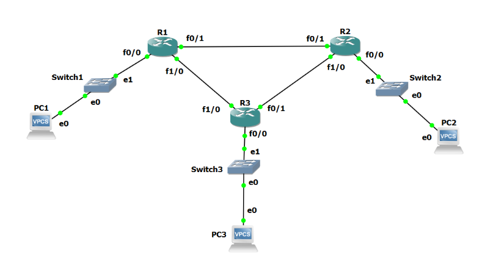
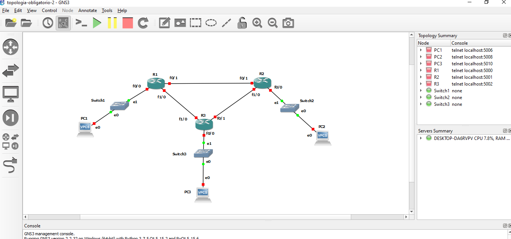
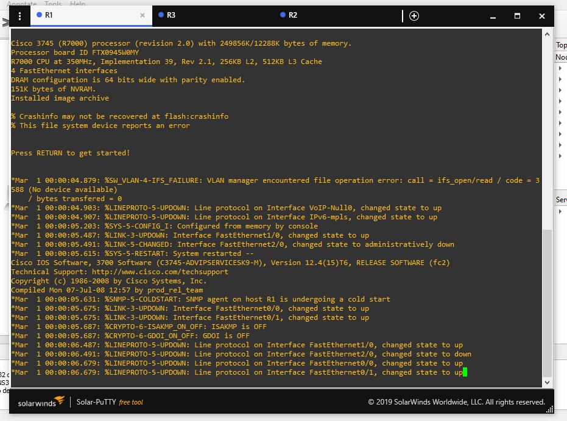

# Obligatorio de Redes

## 3 Aplicaciones

### 3.1 Telnet

*** Escriba el comando utilizado ***

> Acceso al equipo usuario y contraseña redes.

```bash
# Por defecto nos conecta al puerto 23
telnet 192.168.56.2

# En caso de especificar el puerto se usa el siguiente comando
telnet 192.168.56.2 23
```
- El usuario y contraseña son "ort-grupo1"

*** ¿Que tipo de tareas puede realizar en el host de destino? ***

> En el host destino puedo tomar control del equipo, ejecutar comandos, revisar directorios, administrar aplicaciones, etc. Por ejemplo:

```bash
Last login: Tue Mar 22 01:00:38 UTC 2022 from 192.168.56.1 on pts/0
Welcome to Ubuntu 18.04.4 LTS (GNU/Linux 4.15.0-96-generic x86_64)

 * Documentation:  https://help.ubuntu.com
 * Management:     https://landscape.canonical.com
 * Support:        https://ubuntu.com/advantage

  System information as of Tue Mar 22 01:02:18 UTC 2022

  System load:  0.04              Processes:             100
  Usage of /:   89.6% of 2.68GB   Users logged in:       1
  Memory usage: 9%                IP address for enp0s3: 192.168.56.2
  Swap usage:   0%                IP address for enp0s8: 10.0.3.15

  => / is using 89.6% of 2.68GB


0 packages can be updated.
0 updates are security updates.

Failed to connect to https://changelogs.ubuntu.com/meta-release-lts. Check your Internet connection or proxy settings


No mail.
ort-grupo1@servidor_redes:~$ systemctl status ufw.service
ÔùÅ ufw.service - Uncomplicated firewall
   Loaded: loaded (/lib/systemd/system/ufw.service; enabled; vendor preset: enabled)
   Active: active (exited) since Tue 2022-03-22 03:48:20 UTC; 2h 45min left
     Docs: man:ufw(8)
  Process: 401 ExecStart=/lib/ufw/ufw-init start quiet (code=exited, status=0/SUCCESS)
 Main PID: 401 (code=exited, status=0/SUCCESS)

Warning: Journal has been rotated since unit was started. Log output is incomplete or unavailable.
ort-grupo1@servidor_redes:~$ pwd
/home/ort-grupo1
ort-grupo1@servidor_redes:~$ ls /
bin   cdrom  etc   initrd.img      lib    lost+found  mnt  proc  run   snap  sys  usr  vmlinuz
boot  dev    home  initrd.img.old  lib64  media       opt  root  sbin  srv   tmp  var  vmlinuz.old
ort-grupo1@servidor_redes:~$
```

*** ¿Que es necesario para que pueda acceder desde un equipo a otro remoto por Telnet? ***

> Es necesario que el equipo destino tenga habilitado tanto el servicio como el puerto a la escucha.
En el archivo /etc/inetd.conf se encuentra la configuración:

``` bash
#
# Internet superserver configuration database
#
#
# Lines starting with "#:LABEL:" or "#<off>#" should not
# be changed unless you know what you are doing!
#
# If you want to disable an entry so it isn't touched during
# package updates just comment it out with a single '#' character.
#
# Packages should modify this file by using update-inetd(8)
#
# <service_name> <sock_type> <proto> <flags> <user> <server_path> <args>
#
#:INTERNAL: Internal services
#discard                stream  tcp     nowait  root    internal
#discard                dgram   udp     wait    root    internal
#daytime                stream  tcp     nowait  root    internal
#time           stream  tcp     nowait  root    internal

#:STANDARD: These are standard services.
ftp             stream  tcp     nowait  root    /usr/sbin/tcpd  /usr/sbin/in.ftpd
telnet          stream  tcp     nowait  telnetd /usr/sbin/tcpd  /usr/sbin/in.telnetd

```

*** ¿Hasta que capa deben de entenderse los nodos entre si para que el acceso por Telnet sea exitoso? ***

*** Si analiza el trafico capturado con Wireshark: ***
*** ¿Cu´al es el n´umero de puerto de origen y de destino con los que se est´a accediendo? ***

> En la comunicacion el puerto de origen esta en el IP 192.168.56.1 (el pc host) y es el 55381, el puerto de destino es el estandar de Telnet, el puerto 23, en el IP 192.168.56.2 (el equipo virtual).
Se puede ver en la siguiente imagen:


*** Identifique los paquetes Telnet de intercambio entre el cliente y el servidor. ¿Qu´e informaci´on contienen esos paquetes? ***

> Contiene en texto plano toda la comunicacion entre el cliente y el servidor, en la imagen anterior se pudo ver la comunicacion hacia la maquina virtual, en la siguiente se puede ver la respuesta de la misma:


> Dentro de toda la conversacion se marca en la misma el estado del ufw, el firewall del equipo.

### 3.2 SMTP: Simple Mail Transport Protocol - RFC 821

*** ¿Qu´e comando debe ejecutar para conectarse, mediante Telnet, al puerto 25 (SMTP) del servidor? ***

- Para conectarnos a la maquina virtual por Telnet, debemos ejecutar el comando:

```bash
telnet 192.168.56.2 25
```

*** Mediante el empleo del nombre asignado a su usuario (ort-grupo1) realice un di´alogo SMTP a su propio usuario y al usuario ort-grupo2. Detalle cu´ales fueron los comandos utilizados en cada caso ***

```bash
helo ort-grupo1
250 servidor_redes.lan
mail from: ort-grupo1@servidor_redes
250 2.1.0 Ok
rcpt to: ort-grupo2@servidor_redes
250 2.1.5 Ok
data
354 End data with <CR><LF>.<CR><LF>
From: "Federico Alonso" <ort-grupo1@servidor_redes>
To: "Usuario Grupo 2" <ort-grupo2@servidor_redes>
Subject: Dialogo para el oblgatorio
Hola ort-grupo2, esta es una prueba de envio de correo.
Saludos Federico Alonso.
.
```


*** Identifique: el sobre, el encabezado y el cuerpo del mensaje. ¿Cu´ales son las diferencias entre el sobre y el encabezado? ***


> En el sobre no podria mentir los datos, mientras que en el encabezado puedo poner las direcciones que desee.

### 3.3 POP3: Post Office Protocol version 3 - RFC 1939

*** Utilizando el protocolo Telnet, establezca una conexi´on al puerto est´andar del protocolo. Liste el comando utilizado. ***

```bash
telnet 192.168.56.2 110
```

*** Establezca un di´alogo POP3, ingresando con el usuario asignado a su grupo (ort-grupo1), liste sus mensajes y recupere los mismos. ¿Qu´e comandos utiliz´o? ***

```bash
user ort-grupo2
+OK
pass ort-grupo2
+OK Logged in
list
+OK 2 messages:
1 642
2 532
.
retr 1
+OK 642 octets
Return-Path: <ort-grupo1@servidor_redes>
X-Original-To: ort-grupo2@servidor_redes
Delivered-To: ort-grupo2@servidor_redes
Received: from ort-grupo1 (unknown [192.168.56.1])
        by servidor_redes.lan (Postfix) with SMTP id DE943561
        for <ort-grupo2@servidor_redes>; Tue, 22 Mar 2022 01:50:22 +0000 (UTC)
From: "Federico Alonso" <ort-grupo1@servidor_redes>
To: "Usuario Grupo 2" <ort-grupo2@servidor_redes>
Subject: Dialogo para el oblgatorio
Subject: Dialogo para el oblgatorio

Hola ort-grupo2, esta es una prueba de envio de correo.
Saludos Federico Alonso.
.
```
*** Verifique la correcta recepci´on de los mensajes que envi´o a su propio usuario en la parte de SMTP. Borre el ´ultimo mensaje de la casilla. ¿Mediante qu´e comando lo hace? ***

```bash
dele 2
+OK Marked to be deleted.
list
+OK 1 messages:
1 642
.
```

### 3.4 HTTP: Hypertext Transfer Protocol - RFC 1945

*** Establezca una conexi´on al servidor a trav´es del puerto habitual del protocolo HTTP, utilizando la aplicaci´on Telnet. ¿Qu´e comando utiliz´o? ***

  
```bash
telnet 192.168.56.2 80
```

*** Recupere la p´agina de prueba usada para el laboratorio, utilizando como URL la direcci´on IP del servidor. Indique el comando utilizado (cuando ejecute el comando, presione dos veces la tecla “enter”). Indique tambi´en la salida obtenida ***

```bash
GET / HTTP:/1.0
Host: localhost


# Salida

```

*** Indique el lenguaje en el cual est´a escrita la p´agina ***

La pagina esta escrita en HTML.

*** ¿Con qu´e comando traer´ıa ´unicamente el encabezado de la p´agina? Indique la salida obtenida y comp´arela con la obtenida en el punto anterior ***

Con el comando HEAD, se realiza de la siguiente forma:
  
```bash
HEAD / HTTP/1.0
Host: localhost

# Salida

```

*** Acceda mediante un navegador web a la p´agina y compare los resultados obtenidos. ***

Mediante un navegador podemos ver la pagina pronta para que un usuario pueda entenderla, esto se debe a que el navegador interpreta el HTTP y la muestra en pantalla correctamente.


### 3.5 FTP: File Transfer Protocol - RFC 959

*** ¿Cu´al es el objetivo del protocolo FTP? ***

El objetivo de FTP es transferir archivos entre dos equipos. 

*** Con´ectese mediante el cliente FTP de Windows al servidor cuya IP es 192.168.56.2. Utilice el usuario ort-grupo1. ¿Qu´e comando utiliz´o? ***

Se utiliza el comando: ftp 192.168.56.2

```bash
C:\Users\fnico>ftp 192.168.56.2
Conectado a 192.168.56.2.
220 servidor_redes FTP server (Version 6.4/OpenBSD/Linux-ftpd-0.17) ready.
500 'OPTS UTF8 ON': command not understood.
Usuario (192.168.56.2:(none)): ort-grupo1
331 Password required for ort-grupo1.
Contraseña:
230 User ort-grupo1 logged in.
ftp>
```

*** Posici´onese en el directorio /home/publico y liste el contenido del mismo. ¿Qu´e archivos se observa? ***

```bash
ftp> pwd
257 "/home/ort-grupo1" is current directory.
ftp> cd /home/publico
250 CWD command successful.
ftp> dir /home/publico
200 PORT command successful.
150 Opening ASCII mode data connection for '/bin/ls'.
total 476
-rw-r--r-- 1 redes redes 483328 Sep  8  2011 putty.exe
-rw-r--r-- 1 redes redes    447 Sep  8  2011 texto.txt
226 Transfer complete.
ftp: 126 bytes recibidos en 0.00segundos 42.00a KB/s.
```

  1. texto.txt
  2. putty.exe

*** Copie en su PC el archivo correspondiente al cliente SSH (archivo putty.exe). Indique la secuencia de comandos usada, teniendo en cuenta de que se trata de un ejecutable. ***

```bash
ftp> get putty.exe
200 PORT command successful.
150 Opening ASCII mode data connection for 'putty.exe' (483328 bytes).
226 Transfer complete.
ftp: 484455 bytes recibidos en 0.02segundos 23069.29a KB/s.
```

*** ¿Qu´e secuencia de comandos utilizar´ıa si deseara copiar a su equipo todo el contenido del directorio actual indicando que no se desea recibir confirmaci´on para cada archivo a transferir? ***

```bash
ftp> prompt
Modo interactivo Desactivado .
ftp> mget *
200 Type set to A.
200 PORT command successful.
550 72364 putty.exe: No such file or directory.
200 PORT command successful.
550 72382 texto.txt: No such file or directory.
200 PORT command successful.
150 Opening ASCII mode data connection for 'putty.exe' (483328 bytes).
226 Transfer complete.
ftp: 484455 bytes recibidos en 0.02segundos 28497.35a KB/s.
200 PORT command successful.
150 Opening ASCII mode data connection for 'texto.txt' (447 bytes).
226 Transfer complete.
ftp: 447 bytes recibidos en 0.00segundos 447.00a KB/s.
ftp>
```

### 3.6. SSH: Security Shell

*** Usando el cliente SSH obtenido en el ejercicio anterior, establezca una conexión con el servidor al puerto estándar del servidor SSH. Indique cuál fue la configuración empleada. ***

```bash
C:\Users\fnico>ssh ort-grupo1@192.168.56.2
The authenticity of host '192.168.56.2 (192.168.56.2)' can't be established.
ECDSA key fingerprint is SHA256:5kjNN493OKJI+GkWcPSpGtnecuHXxLkBEZLybxCZ7tU.
Are you sure you want to continue connecting (yes/no/[fingerprint])? yes
Warning: Permanently added '192.168.56.2' (ECDSA) to the list of known hosts.
ort-grupo1@192.168.56.2's password:
Welcome to Ubuntu 18.04.4 LTS (GNU/Linux 4.15.0-96-generic x86_64)

 * Documentation:  https://help.ubuntu.com
 * Management:     https://landscape.canonical.com
 * Support:        https://ubuntu.com/advantage

  System information as of Tue Apr  5 02:07:50 UTC 2022

  System load:  0.0               Processes:             97
  Usage of /:   91.0% of 2.68GB   Users logged in:       0
  Memory usage: 9%                IP address for enp0s3: 192.168.56.2
  Swap usage:   0%                IP address for enp0s8: 10.0.3.15

  => / is using 91.0% of 2.68GB

 * Super-optimized for small spaces - read how we shrank the memory
   footprint of MicroK8s to make it the smallest full K8s around.

   https://ubuntu.com/blog/microk8s-memory-optimisation

0 packages can be updated.
0 updates are security updates.


No mail.
Last login: Tue Mar 22 02:12:41 2022 from 192.168.56.1
ort-grupo1@servidor_redes:~$
```

*** ¿Qué diferencias existen entre usar SSH y Telnet? ***
 La principal diferencia es que SSH utliza un protocolo de comunicación seguro, establece un 
 
 
 
 
 canal de comunicación encriptado para mantener la confidencialidad, la autenticación y la integridad de la información. Esto no es posible con Telnet, que utiliza un protocolo de comunicación no seguro.
Por este motivo es que no se habilita más telnet en los servidores. 
Por otro lado, telnet nos da la flexibilidad de poder establecer comunicación mediante otros puertos que no sólo se utilizan para el control total del equipo, lo que se vió en los ejercicios anteriores.

## 4 DNS

```bash
> nslookup mercadolibre.com.br
Servidor:  mercadolibre.com.br
Addresses:  18.65.48.109
          18.65.48.84
          18.65.48.27
          18.65.48.55

DNS request timed out.
    timeout was 2 seconds.
DNS request timed out.
    timeout was 2 seconds.
*** Se agotó el tiempo de espera de la solicitud a mercadolibre.com.br
```


```bash
C:\Users\fnico>nslookup www.lab.ort.edu.uy 192.168.56.2
Servidor:  mail.lab.ort.edu.uy
Address:  192.168.56.2

Nombre:  www.lab.ort.edu.uy
Address:  192.168.56.2
```
```bash
C:\Users\fnico>nslookup 192.168.56.2 192.168.56.2
Servidor:  www.lab.ort.edu.uy
Address:  192.168.56.2

Nombre:  dns.lab.ort.edu.uy
Address:  192.168.56.2
```
```bash
C:\Users\fnico>nslookup -type=mx www.lab.ort.edu.uy 192.168.56.2
Servidor:  mail.lab.ort.edu.uy
Address:  192.168.56.2

lab.ort.edu.uy
        primary name server = dns.lab.ort.edu.uy
        responsible mail addr = ubuntu.lab.ort.edu.uy
        serial  = 2008100100
        refresh = 10800 (3 hours)
        retry   = 1800 (30 mins)
        expire  = 3600 (1 hour)
        default TTL = 3600 (1 hour)
```
```bash
C:\Users\fnico>nslookup -type=soa com.uy 192.168.56.2
Servidor:  www.lab.ort.edu.uy
Address:  192.168.56.2

Respuesta no autoritativa:
com.uy
        primary name server = ns1.anteldata.com.uy
        responsible mail addr = dns-admin.antel.net.uy
        serial  = 2204040545
        refresh = 10800 (3 hours)
        retry   = 1800 (30 mins)
        expire  = 604800 (7 days)
        default TTL = 3600 (1 hour)

com.uy  nameserver = ns1.anteldata.com.uy
com.uy  nameserver = ns2.anteldata.com.uy
com.uy  nameserver = seciu.edu.uy
```
```bash
C:\Users\fnico>nslookup
Servidor predeterminado:  UnKnown
Address:  192.168.201.1

> server 192.168.56.2
Servidor predeterminado:  [192.168.56.2]
Address:  192.168.56.2

> set norecurse
> movistar.com
Servidor:  [192.168.56.2]
Address:  192.168.56.2

Nombre:  movistar.com
Served by:
- k.gtld-servers.net

          com
- l.gtld-servers.net

          com
- m.gtld-servers.net

          com
- e.gtld-servers.net

          com
- a.gtld-servers.net

          com
- g.gtld-servers.net

          com
- f.gtld-servers.net

          com
- h.gtld-servers.net

          com
- c.gtld-servers.net

          com
- i.gtld-servers.net

          com

> set recurse
> movistar.com
Servidor:  [192.168.56.2]
Address:  192.168.56.2

Respuesta no autoritativa:
Nombre:  movistar.com
Address:  192.0.66.32

>
```

Round robin DNS
```bash
> www.yahoo.com
Servidor:  [192.168.56.2]
Address:  192.168.56.2

Respuesta no autoritativa:
Nombre:  new-fp-shed.wg1.b.yahoo.com
Addresses:  2001:4998:44:3507::8000 # <-----
          2001:4998:124:1507::f000
          2001:4998:44:3507::8001
          2001:4998:124:1507::f001
          74.6.143.26
          74.6.143.25 # <-----
          74.6.231.21
          74.6.231.20
Aliases:  www.yahoo.com

> www.yahoo.com
Servidor:  [192.168.56.2]
Address:  192.168.56.2

Respuesta no autoritativa:
Nombre:  new-fp-shed.wg1.b.yahoo.com
Addresses:  2001:4998:44:3507::8001 # <-----
          2001:4998:124:1507::f000
          2001:4998:44:3507::8000
          2001:4998:124:1507::f001
          74.6.143.26
          74.6.231.21 # <-----
          74.6.143.25
          74.6.231.20
Aliases:  www.yahoo.com
```
```bash
C:\Users\fnico>powershell "Measure-Command { nslookup pedidosya.com 2> $null }" | FINDSTR "^Milliseconds"
Milliseconds      : 159

C:\Users\fnico>powershell "Measure-Command { nslookup pedidosya.com 2> $null }" | FINDSTR "^Milliseconds"
Milliseconds      : 76
```
## 5 TCP/HTTP

## 6 Asignación de direccionamiento, configuración del router e interfaces

### 6.1 Topologia



### 6.2 Asignación de direcciones IP

***1. En base a la topología y a las directivas, complete las siguientes tablas de asignación de direcciones.***

| Enlace | Subred (X.X.X.X/M) | IP Router | IP Router |
|---|---|---|---|
| R1 - R2 | 10.15.1.64/30 | 10.15.1.66 | 10.15.1.65 |
| R2 - R3 | 10.15.1.68/30 | 10.15.1.69 | 10.15.1.70 |
| R3 - R1 | 10.15.1.72/30 | 10.15.1.74 | 10.15.1.73 |

| Enlace | Subred (X.X.X.X/M) | IP Router |
|---|---|---|
| SW1 | 10.15.0.0/25 | 10.15.0.1 |
| SW2 | 10.15.1.0/26 | 10.15.1.1 |
| SW3 | 10.15.0.128/25 | 10.15.0.129 |

***2. En GNS3 importe el proyecto portable suministrado por el docente de Teórico, verá que la topología coincide con la Figura 1.***



***3. Comience la simulación y despliegue las consolas de los 3 routers.***



### 6.3 Configuración de interfaces de Ethernet

***1. Basándose en la guía de comandos del Anexo, configure las interfaces hacia el switch y hacia los demás routers en cada router. Detalle los comandos utilizados.***

Se configuran las interfaces de los routers como lo establecido en el ejercicio 6.2.

Los comandos utilizados son:

```bash
configure terminal
interface fastethernet 0/0
ip address 10.15.0.1 255.255.255.252
no shutdown

# Al finalizar debemos guardar los cambios: 
write

# Debemos realizar esto con todas las interfaces en los tres routers.
```

***2. Verifique el estado actual de las interfaces. Detalle los comandos utilizados y los resultados obtenidos. Si las interfaces no se encuentran operativas, detalle el porqué y las acciones que deber realizar para que queden operativas***

Para encerder las interfaces hay que utilizar el comando:

```bash
no shutdown
```

El mismo lo utilizamos en cada configuración de interfaz.

Para verificar el estado de una interfaz en particular, se utiliza el comando:

```bash
R1#show interfaces fastEthernet 0/0
FastEthernet0/0 is up, line protocol is up  # La interfaz se encuentra encendida
  Hardware is Gt96k FE, address is c401.0b90.0000 (bia c401.0b90.0000)
  Internet address is 10.15.0.1/25 # Dirección IP de la misma
  MTU 1500 bytes, BW 10000 Kbit, DLY 1000 usec,
     reliability 255/255, txload 1/255, rxload 1/255
  Encapsulation ARPA, loopback not set
  Keepalive set (10 sec)
  Half-duplex, 10Mb/s, 100BaseTX/FX # Velocidad de transmisión y configuración
  ARP type: ARPA, ARP Timeout 04:00:00
  Last input never, output 00:00:02, output hang never
  Last clearing of "show interface" counters never
  Input queue: 0/75/0/0 (size/max/drops/flushes); Total output drops: 0
  Queueing strategy: fifo
  Output queue: 0/40 (size/max)
  5 minute input rate 0 bits/sec, 0 packets/sec
  5 minute output rate 0 bits/sec, 0 packets/sec
     0 packets input, 0 bytes
     Received 0 broadcasts, 0 runts, 0 giants, 0 throttles
     0 input errors, 0 CRC, 0 frame, 0 overrun, 0 ignored
     0 watchdog
     0 input packets with dribble condition detected
     64 packets output, 7170 bytes, 0 underruns
     0 output errors, 0 collisions, 0 interface resets
     0 babbles, 0 late collision, 0 deferred
     0 lost carrier, 0 no carrier
     0 output buffer failures, 0 output buffers swapped out
```

***3. ¿Cómo vería todas las interfaces que tiene conectadas cada uno de los routers e información sobre cada una de ellas a modo de resumen? Detalle la salida obtenida.***


los mostro en la clase 30/5

6.4 Prueba de conectividad 

7 Rueteo estatico

En esta sección usted podrá configurar rutas de forma estática y verificar
mediante línea de comando el estado de la tabla de ruteo. Una vez configurada
dicha tabla, podrá probar mediante ping llegar a los distintos destinos del
diagrama topológico total y evaluar los resultados.

una ruta estatica agrega una entrada a la tabla de ruteo

1. Configure en cada router las rutas estáticas que le permitan llegar a
todas las subredes, que hasta el momento no son alcanzables. Detalle
los comandos utilizados.

# configurar una ruta estatica
config terminal
              red destino      ip para alcanzarla
ip route 10.0.0.0 255.255.255.0 10.15.0.2


2. Verifique el estado de la tabla de ruteo de los routers. Detalle los co-
mandos utilizados y las salidas obtenidas.
3. Desde la consola de R1, pruebe la conectividad realizando ping a las 6
direcciones IP del resto de los routers. ¿Logra tener éxito en todos los
casos? 
8 Ruteo


 dinamico
