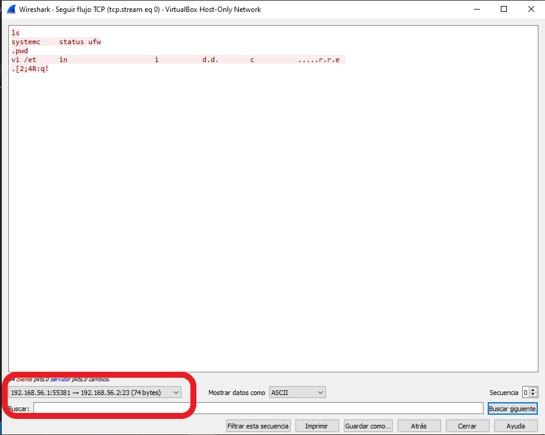
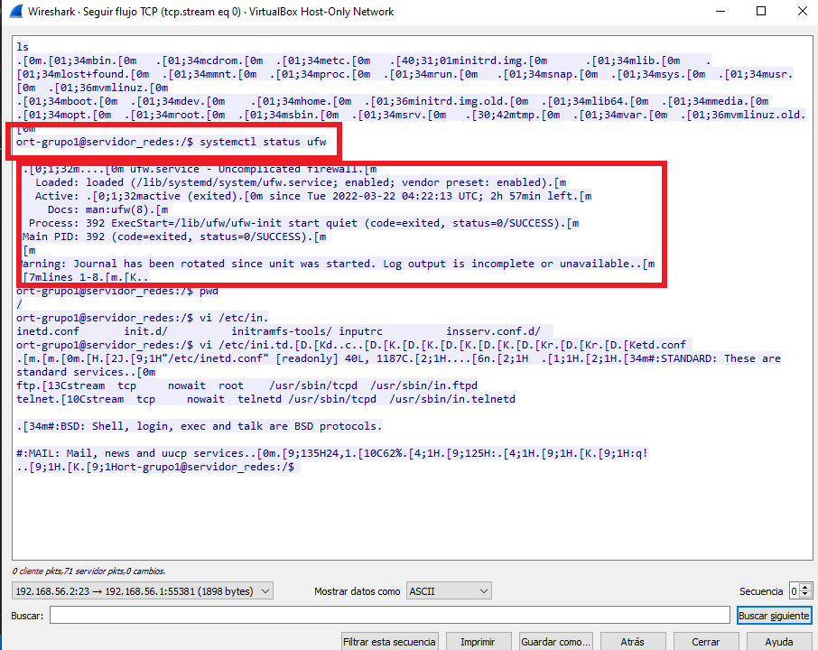
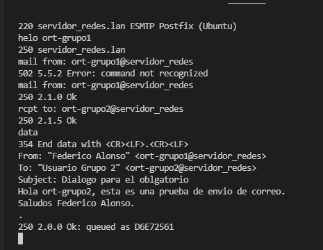
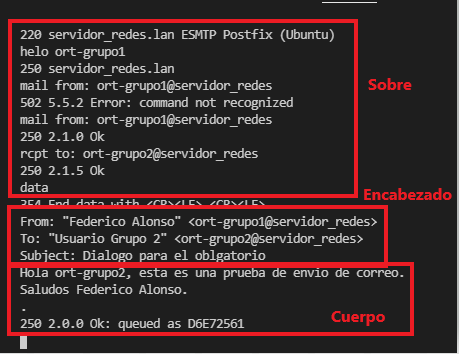
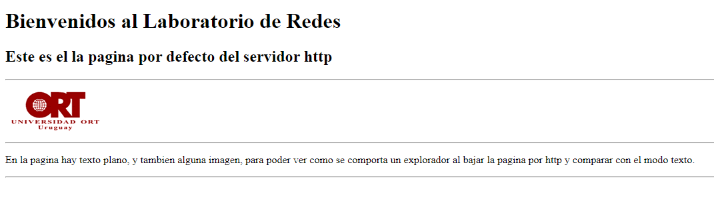
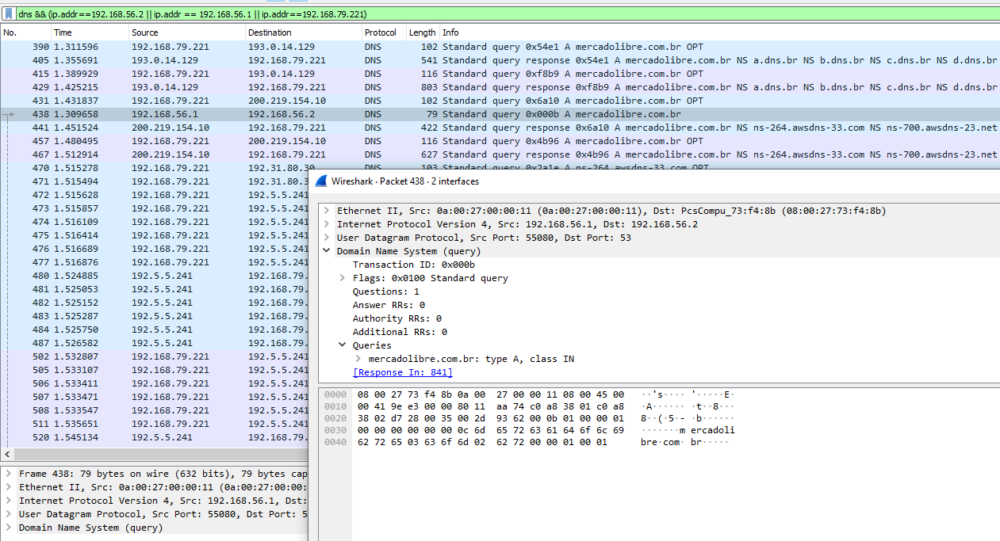
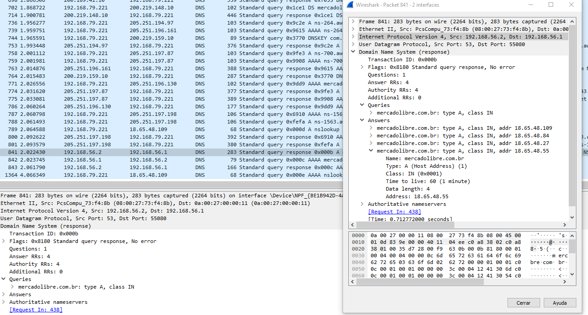
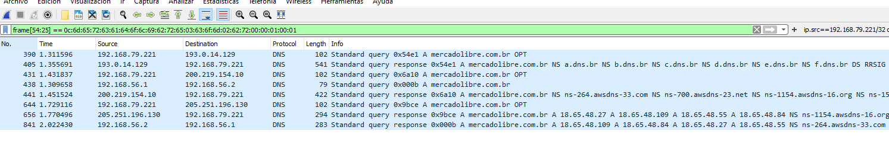
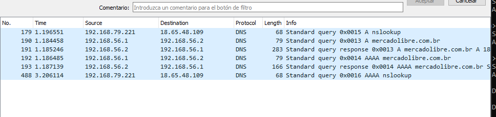

# Obligatorio de Redes

Primera entrega del obligatorio de redes, alumno Federico Alonso, 182999.

## 3 Aplicaciones

### 3.1 Telnet

***1. Escriba el comando utilizado***

> Acceso al equipo usuario y contraseña redes.

```bash
# Por defecto nos conecta al puerto 23
telnet 192.168.56.2

# En caso de especificar el puerto se usa el siguiente comando
telnet 192.168.56.2 23
```
- El usuario y contraseña son "ort-grupo1"

***2. ¿Qué tipo de tareas puede realizar en el host de destino?***

> En el host destino puedo tomar control del equipo, ejecutar comandos, revisar directorios, administrar aplicaciones, etc. 

En el siguiente ejemplo se muestra la conexión al equipo y la ejecución de comandos:

```bash
Last login: Tue Mar 22 01:00:38 UTC 2022 from 192.168.56.1 on pts/0
Welcome to Ubuntu 18.04.4 LTS (GNU/Linux 4.15.0-96-generic x86_64)

 * Documentation:  https://help.ubuntu.com
 * Management:     https://landscape.canonical.com
 * Support:        https://ubuntu.com/advantage

  System information as of Tue Mar 22 01:02:18 UTC 2022

  System load:  0.04              Processes:             100
  Usage of /:   89.6% of 2.68GB   Users logged in:       1
  Memory usage: 9%                IP address for enp0s3: 192.168.56.2
  Swap usage:   0%                IP address for enp0s8: 10.0.3.15

  => / is using 89.6% of 2.68GB


0 packages can be updated.
0 updates are security updates.

Failed to connect to https://changelogs.ubuntu.com/meta-release-lts. Check your Internet connection or proxy settings


No mail.
ort-grupo1@servidor_redes:~$ systemctl status ufw.service
ÔùÅ ufw.service - Uncomplicated firewall
   Loaded: loaded (/lib/systemd/system/ufw.service; enabled; vendor preset: enabled)
   Active: active (exited) since Tue 2022-03-22 03:48:20 UTC; 2h 45min left
     Docs: man:ufw(8)
  Process: 401 ExecStart=/lib/ufw/ufw-init start quiet (code=exited, status=0/SUCCESS)
 Main PID: 401 (code=exited, status=0/SUCCESS)

Warning: Journal has been rotated since unit was started. Log output is incomplete or unavailable.
ort-grupo1@servidor_redes:~$ pwd
/home/ort-grupo1
ort-grupo1@servidor_redes:~$ ls /
bin   cdrom  etc   initrd.img      lib    lost+found  mnt  proc  run   snap  sys  usr  vmlinuz
boot  dev    home  initrd.img.old  lib64  media       opt  root  sbin  srv   tmp  var  vmlinuz.old
ort-grupo1@servidor_redes:~$
```

***3. ¿Qué es necesario para que pueda acceder desde un equipo a otro remoto por Telnet?***

> Es necesario que el equipo destino tenga habilitado tanto el servicio como el puerto a la escucha.
En el archivo /etc/inetd.conf se encuentra la configuración:

``` bash
#
# Internet superserver configuration database
#
#
# Lines starting with "#:LABEL:" or "#<off>#" should not
# be changed unless you know what you are doing!
#
# If you want to disable an entry so it isn't touched during
# package updates just comment it out with a single '#' character.
#
# Packages should modify this file by using update-inetd(8)
#
# <service_name> <sock_type> <proto> <flags> <user> <server_path> <args>
#
#:INTERNAL: Internal services
#discard                stream  tcp     nowait  root    internal
#discard                dgram   udp     wait    root    internal
#daytime                stream  tcp     nowait  root    internal
#time           stream  tcp     nowait  root    internal

#:STANDARD: These are standard services.
ftp             stream  tcp     nowait  root    /usr/sbin/tcpd  /usr/sbin/in.ftpd
telnet          stream  tcp     nowait  telnetd /usr/sbin/tcpd  /usr/sbin/in.telnetd

```

***4. ¿Hasta qué capa deben de entenderse los nodos entre si para que el acceso por Telnet sea exitoso?***

> Hasta la capa de aplicación.

***5. Si analiza el tráfico capturado con Wireshark:***
***5.1 ¿Cuál es el número de puerto de orígen y de destino con los que se está accediendo?***

> En la comunicación el puerto de origen está en el IP 192.168.56.1 (el pc host) y es el 55381, el puerto de destino es el estándar de Telnet, el puerto 23, en el IP 192.168.56.2 (el equipo virtual).
Se puede ver en la siguiente imágen:



***5.2 Identifique los paquetes Telnet de intercambio entre el cliente y el servidor. ¿Qué información contienen esos paquetes?***

> Contiene en texto plano toda la comunicación entre el cliente y el servidor, en la imagen anterior se pudo ver la comunicación hacia la máquina virtual, en la siguiente se puede ver la respuesta de la misma:



> Dentro de toda la conversación se marca en la misma el estado del ufw, el firewall del equipo.

### 3.2 SMTP: Simple Mail Transport Protocol - RFC 821

***1. ¿Qué comando debe ejecutar para conectarse, mediante Telnet, al puerto 25 (SMTP) del servidor?***

- Para conectarnos a la máquina virtual por Telnet, debemos ejecutar el comando:

```bash
telnet 192.168.56.2 25
```

***2. Mediante el empleo del nombre asignado a su usuario (ort-grupo1) realice un diálogo SMTP a su propio usuario y al usuario ort-grupo2. Detalle cuáles fueron los comandos utilizados en cada caso.***

```bash
helo ort-grupo1
250 servidor_redes.lan
mail from: ort-grupo1@servidor_redes
250 2.1.0 Ok
rcpt to: ort-grupo2@servidor_redes
250 2.1.5 Ok
data
354 End data with <CR><LF>.<CR><LF>
From: "Federico Alonso" <ort-grupo1@servidor_redes>
To: "Usuario Grupo 2" <ort-grupo2@servidor_redes>
Subject: Dialogo para el oblgatorio
Hola ort-grupo2, esta es una prueba de envio de correo.
Saludos Federico Alonso.
.
```


***3. Identifique: el sobre, el encabezado y el cuerpo del mensaje. ¿Cuáles son las diferencias entre el sobre y el encabezado?***



> En el sobre no podría mentir los datos, mientras que en el encabezado puedo poner las direcciones que desee.

### 3.3 POP3: Post Office Protocol version 3 - RFC 1939

***1. Utilizando el protocolo Telnet, establezca una conexión al puerto estándar del protocolo. Liste el comando utilizado.***

```bash
telnet 192.168.56.2 110
```

***2. Establezca un diálogo POP3, ingresando con el usuario asignado a su grupo (ort-grupo1), liste sus mensajes y recupere los mismos. ¿Qué comandos utilizó?***

```bash
user ort-grupo2
+OK
pass ort-grupo2
+OK Logged in
list
+OK 2 messages:
1 642
2 532
.
retr 1
+OK 642 octets
Return-Path: <ort-grupo1@servidor_redes>
X-Original-To: ort-grupo2@servidor_redes
Delivered-To: ort-grupo2@servidor_redes
Received: from ort-grupo1 (unknown [192.168.56.1])
        by servidor_redes.lan (Postfix) with SMTP id DE943561
        for <ort-grupo2@servidor_redes>; Tue, 22 Mar 2022 01:50:22 +0000 (UTC)
From: "Federico Alonso" <ort-grupo1@servidor_redes>
To: "Usuario Grupo 2" <ort-grupo2@servidor_redes>
Subject: Dialogo para el oblgatorio
Subject: Dialogo para el oblgatorio

Hola ort-grupo2, esta es una prueba de envio de correo.
Saludos Federico Alonso.
.
```
***3. Verifique la correcta recepción de los mensajes que envió a su propio usuario en la parte de SMTP. Borre el último mensaje de la casilla. ¿Mediante qué comando lo hace?***

```bash
dele 2
+OK Marked to be deleted.
list
+OK 1 messages:
1 642
.
```

### 3.4 HTTP: Hypertext Transfer Protocol - RFC 1945

***1. Establezca una conexión al servidor a través del puerto habitual del protocolo HTTP, utilizando la aplicación Telnet. ¿Qué comando utilizó?***

  
```bash
telnet 192.168.56.2 80
```

***2. Recupere la página de prueba usada para el laboratorio, utilizando como URL la dirección IP del servidor. Indique el comando utilizado (cuando ejecute el comando, presione dos veces la tecla “enter”). Indique también la salida obtenida.***

Como tuve problemas para poder verlo con el ejemplo, muestro la salida de una página simple levantada en mi equipo, utilizo el puerto 8082 en mi ejemplo, en la realidad el pueto HTTP es el 80.

```bash
# Los comandos utilizados son telnet localhost 8082 y GET / HTTP/1.0

federico@federico-PC:~/Documentos/Gitlab$ telnet localhost 8082
Trying 127.0.0.1...
Connected to localhost.
Escape character is '^]'.
GET / HTTP/1.0

HTTP/1.1 200 OK
Date: Mon, 02 May 2022 23:54:17 GMT
Server: Apache/2.4.53 (Debian)
Last-Modified: Mon, 02 May 2022 23:36:53 GMT
ETag: "1b6-5de0fddf9a4ed"
Accept-Ranges: bytes
Content-Length: 438
Vary: Accept-Encoding
Connection: close
Content-Type: text/html

<!DOCTYPE html>
<html lang="en">
<head>
    <meta charset="UTF-8">
    <meta http-equiv="X-UA-Compatible" content="IE=edge">
    <meta name="viewport" content="width=device-width, initial-scale=1.0">
    <title>Document</title>
</head>
<body>
    <h1>Hola mundo desde apache!!</h1>
    <p>Página de ejemplo para que podamos ver la diferencia entre ver una página por código, en contrasete con verla en un navegador.</p>
</body>
</html>Connection closed by foreign host.
```

***3. Indique el lenguaje en el cual está escrita la página***

> La página esta escrita en HTML.

***4. ¿Con qué comando traería únicamente el encabezado de la página? Indique la salida obtenida y compárela con la obtenida en el punto anterior***

Con el comando HEAD, se realiza de la siguiente forma:
  
```bash
# El comando sería telnet localhost 8082 para conectarnos
# HEAD / HTTP/1.0 para obtener el head
federico@federico-PC:~/Documentos/Gitlab$ telnet localhost 8082
Trying 127.0.0.1...
Connected to localhost.
Escape character is '^]'.
HEAD / HTTP/1.0

HTTP/1.1 200 OK
Date: Mon, 02 May 2022 23:56:23 GMT
Server: Apache/2.4.53 (Debian)
Last-Modified: Mon, 02 May 2022 23:36:53 GMT
ETag: "1b6-5de0fddf9a4ed"
Accept-Ranges: bytes
Content-Length: 438
Vary: Accept-Encoding
Connection: close
Content-Type: text/html

Connection closed by foreign host.
```

***5. Acceda mediante un navegador web a la página y compare los resultados obtenidos.***

Mediante un navegador podemos ver la página pronta para que un usuario pueda entenderla, esto se debe a que el navegador interpreta el HTTP y la muestra en pantalla correctamente.



### 3.5 FTP: File Transfer Protocol - RFC 959

***1. ¿Cuál es el objetivo del protocolo FTP?***

El objetivo de FTP es transferir archivos entre dos equipos. 

***2. Conéctese mediante el cliente FTP de Windows al servidor cuya IP es 192.168.56.2. Utilice el usuario ort-grupo1. ¿Qué comando utilizó?***

Se utiliza el comando: ftp 192.168.56.2

```bash
C:\Users\fnico>ftp 192.168.56.2
Conectado a 192.168.56.2.
220 servidor_redes FTP server (Version 6.4/OpenBSD/Linux-ftpd-0.17) ready.
500 'OPTS UTF8 ON': command not understood.
Usuario (192.168.56.2:(none)): ort-grupo1
331 Password required for ort-grupo1.
Contraseña:
230 User ort-grupo1 logged in.
ftp>
```

***3. Posiciónese en el directorio /home/publico y liste el contenido del mismo. ¿Qué archivos se observa?***

```bash
ftp> pwd
257 "/home/ort-grupo1" is current directory.
ftp> cd /home/publico
250 CWD command successful.
ftp> dir /home/publico
200 PORT command successful.
150 Opening ASCII mode data connection for '/bin/ls'.
total 476
-rw-r--r-- 1 redes redes 483328 Sep  8  2011 putty.exe
-rw-r--r-- 1 redes redes    447 Sep  8  2011 texto.txt
226 Transfer complete.
ftp: 126 bytes recibidos en 0.00segundos 42.00a KB/s.
```

  1. texto.txt
  2. putty.exe

***4. Copie en su PC el archivo correspondiente al cliente SSH (archivo putty.exe). Indique la secuencia de comandos usada, teniendo en cuenta de que se trata de un ejecutable.***

```bash
ftp> get putty.exe
200 PORT command successful.
150 Opening ASCII mode data connection for 'putty.exe' (483328 bytes).
226 Transfer complete.
ftp: 484455 bytes recibidos en 0.02segundos 23069.29a KB/s.
```

***5. ¿Qué secuencia de comandos utilizaría si deseara copiar a su equipo todo el contenido del directorio actual indicando que no se desea recibir confirmación para cada archivo a transferir?***

```bash
ftp> prompt
Modo interactivo Desactivado .
ftp> mget *
200 Type set to A.
200 PORT command successful.
550 72364 putty.exe: No such file or directory.
200 PORT command successful.
550 72382 texto.txt: No such file or directory.
200 PORT command successful.
150 Opening ASCII mode data connection for 'putty.exe' (483328 bytes).
226 Transfer complete.
ftp: 484455 bytes recibidos en 0.02segundos 28497.35a KB/s.
200 PORT command successful.
150 Opening ASCII mode data connection for 'texto.txt' (447 bytes).
226 Transfer complete.
ftp: 447 bytes recibidos en 0.00segundos 447.00a KB/s.
ftp>
```

### 3.6. SSH: Security Shell

***1. Usando el cliente SSH obtenido en el ejercicio anterior, establezca una conexión con el servidor al puerto estándar del servidor SSH. Indique cuál fue la configuración empleada.***

En putty debo poner en el host el IP del servidor al que quiero acceder, también puedo poner el nombre de usuario, además configurar el puerto en caso de que no sea el estándar. Putty nos permite además guardar las configuraciones y configurar claves SSH para poder acceder sin colocar contraseña, haciéndo que el mismo usuario del equipo se autentique en el momento de la conexión.

```bash
C:\Users\fnico>ssh ort-grupo1@192.168.56.2
The authenticity of host '192.168.56.2 (192.168.56.2)' can't be established.
ECDSA key fingerprint is SHA256:5kjNN493OKJI+GkWcPSpGtnecuHXxLkBEZLybxCZ7tU.
Are you sure you want to continue connecting (yes/no/[fingerprint])? yes
Warning: Permanently added '192.168.56.2' (ECDSA) to the list of known hosts.
ort-grupo1@192.168.56.2's password:
Welcome to Ubuntu 18.04.4 LTS (GNU/Linux 4.15.0-96-generic x86_64)

 * Documentation:  https://help.ubuntu.com
 * Management:     https://landscape.canonical.com
 * Support:        https://ubuntu.com/advantage

  System information as of Tue Apr  5 02:07:50 UTC 2022

  System load:  0.0               Processes:             97
  Usage of /:   91.0% of 2.68GB   Users logged in:       0
  Memory usage: 9%                IP address for enp0s3: 192.168.56.2
  Swap usage:   0%                IP address for enp0s8: 10.0.3.15

  => / is using 91.0% of 2.68GB

 * Super-optimized for small spaces - read how we shrank the memory
   footprint of MicroK8s to make it the smallest full K8s around.

   https://ubuntu.com/blog/microk8s-memory-optimisation

0 packages can be updated.
0 updates are security updates.


No mail.
Last login: Tue Mar 22 02:12:41 2022 from 192.168.56.1
ort-grupo1@servidor_redes:~$
```

***2. ¿Qué diferencias existen entre usar SSH y Telnet?***

La principal diferencia es que SSH utliza un protocolo de comunicación seguro, establece un canal de comunicación encriptado para mantener la confidencialidad, la autenticación y la integridad de la información. Esto no es posible con Telnet, que utiliza un protocolo de comunicación no seguro.
Por este motivo es que no se habilita más telnet en los servidores. 
Por otro lado, telnet nos da la flexibilidad de poder establecer comunicación mediante otros puertos que no sólo se utilizan para el control total del equipo, lo que se vió en los ejercicios anteriores.

## 4 DNS

***1. Realice una consulta DNS por un registro A usando el comando nslookup. Elija un sitio que no haya sido utilizado recientemente. Indique el sitio, el comando utilizado y la respuesta.***

* Sitio: mercadolibre.com.br
* Comando: nslookup mercadolibre.com.br

```bash
> nslookup mercadolibre.com.br
Servidor:  mercadolibre.com.br
Addresses:  18.65.48.109
          18.65.48.84
          18.65.48.27
          18.65.48.55

DNS request timed out.
    timeout was 2 seconds.
DNS request timed out.
    timeout was 2 seconds.
*** Se agotó el tiempo de espera de la solicitud a mercadolibre.com.br
```

***2. Detalle el intercambio observado en Wireshark por el servidor para resolver la consulta, poniendo énfasis en quién origina la consulta, quién responde y los posibles pasos intermedios. Puede ser necesario aplicar filtros en Wireshark para lograr reducir la cantidad de paquetes visualizados (protocolo DNS por ejemplo). Tener en cuenta que existe una gran cantidad de tráfico que se cursa habitualmente por la conexión utilizada por el PC para acceder a Internet.***




***3. Reinicie la captura de Wireshark (puede guardar la anterior si así lo desea). Realice la misma consulta DNS y analice nuevamente el intercambio en Wireshark. ¿El servidor contesta de caché? ¿Cómo distingue si la respuesta es de caché o no? Detalle las diferencias con el caso anterior.***

Como podemos ver en estas siguientes imágenes, el servidor efectivamente está respondiendo de caché, ya que el mismo no "sale" a buscar la dirección IP buscada, él anteriormente había realizado la búsqueda y "recuerda" la respuesta.




***4. Obtenga la dirección IP asociada al nombre www.lab.ort.edu.uy. Detalle el comando y la salida obtenida.***

El comando es nslookup www.lab.ort.edu.uy 192.168.56.2, y la salida se muestra a continuación.

```bash
C:\Users\fnico>nslookup www.lab.ort.edu.uy 192.168.56.2
Servidor:  mail.lab.ort.edu.uy
Address:  192.168.56.2

Nombre:  www.lab.ort.edu.uy
Address:  192.168.56.2
```
***5. Obtenga todos los dominios asociados a la dirección IP 192.168.56.2. Indique el comando y la respuesta obtenida.***

```bash
C:\Users\fnico>nslookup 192.168.56.2 192.168.56.2
Servidor:  www.lab.ort.edu.uy
Address:  192.168.56.2

Nombre:  dns.lab.ort.edu.uy
Address:  192.168.56.2
```

***6. ¿Cuál es el registro por el que se debe preguntar para conocer el servidor al cual podemos entregar correos para el dominio lab.ort.edu.uy? Realice la consulta y detalle los comandos utilizados.***

Se debe preguntar por el registro MX, nos muestra el servidor y datos de la configuración del mismo.

```bash
C:\Users\fnico>nslookup -type=mx www.lab.ort.edu.uy 192.168.56.2
Servidor:  mail.lab.ort.edu.uy
Address:  192.168.56.2

lab.ort.edu.uy
        primary name server = dns.lab.ort.edu.uy
        responsible mail addr = ubuntu.lab.ort.edu.uy
        serial  = 2008100100
        refresh = 10800 (3 hours)
        retry   = 1800 (30 mins)
        expire  = 3600 (1 hour)
        default TTL = 3600 (1 hour)
```

***7. ¿Cuál es el comando para encontrar los servidores autoritativos del dominio com.uy? Indique el comando y detalle los resultados obtenidos.***

Se debe preguntar por el registro SOA.

```bash
C:\Users\fnico>nslookup -type=soa com.uy 192.168.56.2
Servidor:  www.lab.ort.edu.uy
Address:  192.168.56.2

Respuesta no autoritativa:
com.uy
        primary name server = ns1.anteldata.com.uy
        responsible mail addr = dns-admin.antel.net.uy
        serial  = 2204040545
        refresh = 10800 (3 hours)
        retry   = 1800 (30 mins)
        expire  = 604800 (7 days)
        default TTL = 3600 (1 hour)

com.uy  nameserver = ns1.anteldata.com.uy
com.uy  nameserver = ns2.anteldata.com.uy
com.uy  nameserver = seciu.edu.uy
```

***8. Realice una consulta no recursiva, usando el registro A, correspondiente a un dominio por el cual no haya consultado anteriormente. Indique el comando utilizado y la salida obtenida. ¿Puede obtener la respuesta? ¿Por qué?***

Cuando hacemos una consulta no recursiva, no conseguiremos la respuesta entera, sino una respuesta parcial correspondiente al root server a los que le debemos preguntar por el top-level domain, en nuestro caso que buscamos por movistar.com, debemos preguntarle por .com.

```bash
C:\Users\fnico>nslookup
Servidor predeterminado:  UnKnown
Address:  192.168.201.1

> server 192.168.56.2
Servidor predeterminado:  [192.168.56.2]
Address:  192.168.56.2

> set norecurse
> movistar.com
Servidor:  [192.168.56.2]
Address:  192.168.56.2

Nombre:  movistar.com
Served by:
- k.gtld-servers.net

          com
- l.gtld-servers.net

          com
- m.gtld-servers.net

          com
- e.gtld-servers.net

          com
- a.gtld-servers.net

          com
- g.gtld-servers.net

          com
- f.gtld-servers.net

          com
- h.gtld-servers.net

          com
- c.gtld-servers.net

          com
- i.gtld-servers.net

          com
```

***9. Vuelva a realizar la consulta pero en modo recursivo. Indique el comando utilizado y la salida obtenida. ¿Puede obtener la respuesta ahora?¿Por qué?***

Ahora sí vemos la respuesta, ya que el servidor de dns realiza toda la consulta y nos devuelve el resultado final.

```bash
> set recurse
> movistar.com
Servidor:  [192.168.56.2]
Address:  192.168.56.2

Respuesta no autoritativa:
Nombre:  movistar.com
Address:  192.0.66.32
```

***10. Haga una consulta correspondiente a www.yahoo.com y repita inmediatamente la misma consulta. Detalle las consultas y las salidas obtenidas.Compare las respuestas y explique las diferencias.***

Podemos ver que se realiza round robin de dns. Esto se realiza por dos motivos principales, uno de ellos repartir la carga y el otro mantener disponible el servicio en caso de falla de alguno de los servidores. En cualquiera de los casos (IPV6 o IPV4) nos alteró el orden en las direcciones que marca las flechas, para que clientes distintos pregunten a servidores distintos.

```bash
> www.yahoo.com
Servidor:  [192.168.56.2]
Address:  192.168.56.2

Respuesta no autoritativa:
Nombre:  new-fp-shed.wg1.b.yahoo.com
Addresses:  2001:4998:44:3507::8000 # <-----
          2001:4998:124:1507::f000
          2001:4998:44:3507::8001
          2001:4998:124:1507::f001
          74.6.143.26
          74.6.143.25 # <-----
          74.6.231.21
          74.6.231.20
Aliases:  www.yahoo.com

> www.yahoo.com
Servidor:  [192.168.56.2]
Address:  192.168.56.2

Respuesta no autoritativa:
Nombre:  new-fp-shed.wg1.b.yahoo.com
Addresses:  2001:4998:44:3507::8001 # <-----
          2001:4998:124:1507::f000
          2001:4998:44:3507::8000
          2001:4998:124:1507::f001
          74.6.143.26
          74.6.231.21 # <-----
          74.6.143.25
          74.6.231.20
Aliases:  www.yahoo.com
```

A su vez, podemos observar la diferencia en tiempo entre una consulta y la otra con el siguiente comando.

```bash
C:\Users\fnico>powershell "Measure-Command { nslookup pedidosya.com 2> $null }" | FINDSTR "^Milliseconds"
Milliseconds      : 159

C:\Users\fnico>powershell "Measure-Command { nslookup pedidosya.com 2> $null }" | FINDSTR "^Milliseconds"
Milliseconds      : 76
```