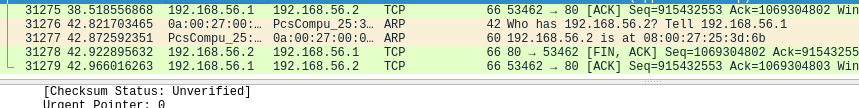

# Obligatorio de Redes

Obligatorio realizado para la materia de Redes en la universidad ORT, alumno Federico Alonso, 182999.

## 3 Aplicaciones

### 3.1 Telnet

***1. Escriba el comando utilizado***

> Acceso al equipo usuario y contraseña redes.

```bash
# Por defecto nos conecta al puerto 23
telnet 192.168.56.2

# En caso de especificar el puerto se usa el siguiente comando
telnet 192.168.56.2 23
```
- El usuario y contraseña son "ort-grupo1"

***2. ¿Qué tipo de tareas puede realizar en el host de destino?***

> En el host destino puedo tomar control del equipo, ejecutar comandos, revisar directorios, administrar aplicaciones, etc. 

En el siguiente ejemplo se muestra la conexión al equipo y la ejecución de comandos:

```bash
Last login: Tue Mar 22 01:00:38 UTC 2022 from 192.168.56.1 on pts/0
Welcome to Ubuntu 18.04.4 LTS (GNU/Linux 4.15.0-96-generic x86_64)

 * Documentation:  https://help.ubuntu.com
 * Management:     https://landscape.canonical.com
 * Support:        https://ubuntu.com/advantage

  System information as of Tue Mar 22 01:02:18 UTC 2022

  System load:  0.04              Processes:             100
  Usage of /:   89.6% of 2.68GB   Users logged in:       1
  Memory usage: 9%                IP address for enp0s3: 192.168.56.2
  Swap usage:   0%                IP address for enp0s8: 10.0.3.15

  => / is using 89.6% of 2.68GB


0 packages can be updated.
0 updates are security updates.

Failed to connect to https://changelogs.ubuntu.com/meta-release-lts. Check your Internet connection or proxy settings


No mail.
ort-grupo1@servidor_redes:~$ systemctl status ufw.service
ÔùÅ ufw.service - Uncomplicated firewall
   Loaded: loaded (/lib/systemd/system/ufw.service; enabled; vendor preset: enabled)
   Active: active (exited) since Tue 2022-03-22 03:48:20 UTC; 2h 45min left
     Docs: man:ufw(8)
  Process: 401 ExecStart=/lib/ufw/ufw-init start quiet (code=exited, status=0/SUCCESS)
 Main PID: 401 (code=exited, status=0/SUCCESS)

Warning: Journal has been rotated since unit was started. Log output is incomplete or unavailable.
ort-grupo1@servidor_redes:~$ pwd
/home/ort-grupo1
ort-grupo1@servidor_redes:~$ ls /
bin   cdrom  etc   initrd.img      lib    lost+found  mnt  proc  run   snap  sys  usr  vmlinuz
boot  dev    home  initrd.img.old  lib64  media       opt  root  sbin  srv   tmp  var  vmlinuz.old
ort-grupo1@servidor_redes:~$
```

***3. ¿Qué es necesario para que pueda acceder desde un equipo a otro remoto por Telnet?***

> Es necesario que el equipo destino tenga habilitado tanto el servicio como el puerto a la escucha.
En el archivo /etc/inetd.conf se encuentra la configuración:

``` bash
#
# Internet superserver configuration database
#
#
# Lines starting with "#:LABEL:" or "#<off>#" should not
# be changed unless you know what you are doing!
#
# If you want to disable an entry so it isn't touched during
# package updates just comment it out with a single '#' character.
#
# Packages should modify this file by using update-inetd(8)
#
# <service_name> <sock_type> <proto> <flags> <user> <server_path> <args>
#
#:INTERNAL: Internal services
#discard                stream  tcp     nowait  root    internal
#discard                dgram   udp     wait    root    internal
#daytime                stream  tcp     nowait  root    internal
#time           stream  tcp     nowait  root    internal

#:STANDARD: These are standard services.
ftp             stream  tcp     nowait  root    /usr/sbin/tcpd  /usr/sbin/in.ftpd
telnet          stream  tcp     nowait  telnetd /usr/sbin/tcpd  /usr/sbin/in.telnetd

```

***4. ¿Hasta qué capa deben de entenderse los nodos entre si para que el acceso por Telnet sea exitoso?***

> Hasta la capa de aplicación.

***5. Si analiza el tráfico capturado con Wireshark:***
***5.1 ¿Cuál es el número de puerto de orígen y de destino con los que se está accediendo?***

> En la comunicación el puerto de origen está en el IP 192.168.56.1 (el pc host) y es el 55381, el puerto de destino es el estándar de Telnet, el puerto 23, en el IP 192.168.56.2 (el equipo virtual).
Se puede ver en la siguiente imágen:


***5.2 Identifique los paquetes Telnet de intercambio entre el cliente y el servidor. ¿Qué información contienen esos paquetes?***

> Contiene en texto plano toda la comunicación entre el cliente y el servidor, en la imagen anterior se pudo ver la comunicación hacia la máquina virtual, en la siguiente se puede ver la respuesta de la misma:


> Dentro de toda la conversación se marca en la misma el estado del ufw, el firewall del equipo.

### 3.2 SMTP: Simple Mail Transport Protocol - RFC 821

***1. ¿Qué comando debe ejecutar para conectarse, mediante Telnet, al puerto 25 (SMTP) del servidor?***

- Para conectarnos a la máquina virtual por Telnet, debemos ejecutar el comando:

```bash
telnet 192.168.56.2 25
```

***2. Mediante el empleo del nombre asignado a su usuario (ort-grupo1) realice un diálogo SMTP a su propio usuario y al usuario ort-grupo2. Detalle cuáles fueron los comandos utilizados en cada caso.***

```bash
helo ort-grupo1
250 servidor_redes.lan
mail from: ort-grupo1@servidor_redes
250 2.1.0 Ok
rcpt to: ort-grupo2@servidor_redes
250 2.1.5 Ok
data
354 End data with <CR><LF>.<CR><LF>
From: "Federico Alonso" <ort-grupo1@servidor_redes>
To: "Usuario Grupo 2" <ort-grupo2@servidor_redes>
Subject: Dialogo para el oblgatorio
Hola ort-grupo2, esta es una prueba de envio de correo.
Saludos Federico Alonso.
.
```


***3. Identifique: el sobre, el encabezado y el cuerpo del mensaje. ¿Cuáles son las diferencias entre el sobre y el encabezado?***


> En el sobre no podría mentir los datos, mientras que en el encabezado puedo poner las direcciones que desee.

### 3.3 POP3: Post Office Protocol version 3 - RFC 1939

***1. Utilizando el protocolo Telnet, establezca una conexión al puerto estándar del protocolo. Liste el comando utilizado.***

```bash
telnet 192.168.56.2 110
```

***2. Establezca un diálogo POP3, ingresando con el usuario asignado a su grupo (ort-grupo1), liste sus mensajes y recupere los mismos. ¿Qué comandos utilizó?***

```bash
user ort-grupo2
+OK
pass ort-grupo2
+OK Logged in
list
+OK 2 messages:
1 642
2 532
.
retr 1
+OK 642 octets
Return-Path: <ort-grupo1@servidor_redes>
X-Original-To: ort-grupo2@servidor_redes
Delivered-To: ort-grupo2@servidor_redes
Received: from ort-grupo1 (unknown [192.168.56.1])
        by servidor_redes.lan (Postfix) with SMTP id DE943561
        for <ort-grupo2@servidor_redes>; Tue, 22 Mar 2022 01:50:22 +0000 (UTC)
From: "Federico Alonso" <ort-grupo1@servidor_redes>
To: "Usuario Grupo 2" <ort-grupo2@servidor_redes>
Subject: Dialogo para el oblgatorio
Subject: Dialogo para el oblgatorio

Hola ort-grupo2, esta es una prueba de envio de correo.
Saludos Federico Alonso.
.
```
***3. Verifique la correcta recepción de los mensajes que envió a su propio usuario en la parte de SMTP. Borre el último mensaje de la casilla. ¿Mediante qué comando lo hace?***

```bash
dele 2
+OK Marked to be deleted.
list
+OK 1 messages:
1 642
.
```

### 3.4 HTTP: Hypertext Transfer Protocol - RFC 1945

***1. Establezca una conexión al servidor a través del puerto habitual del protocolo HTTP, utilizando la aplicación Telnet. ¿Qué comando utilizó?***

  
```bash
telnet 192.168.56.2 80
```

***2. Recupere la página de prueba usada para el laboratorio, utilizando como URL la dirección IP del servidor. Indique el comando utilizado (cuando ejecute el comando, presione dos veces la tecla “enter”). Indique también la salida obtenida.***

Como tuve problemas para poder verlo con el ejemplo, muestro la salida de una página simple levantada en mi equipo, utilizo el puerto 8082 en mi ejemplo, en la realidad el puerto HTTP es el 80.

```bash
# Los comandos utilizados son telnet localhost 8082 y GET / HTTP/1.0

federico@federico-PC:~/Documentos/Gitlab$ telnet localhost 8082
Trying 127.0.0.1...
Connected to localhost.
Escape character is '^]'.
GET / HTTP/1.0

HTTP/1.1 200 OK
Date: Mon, 02 May 2022 23:54:17 GMT
Server: Apache/2.4.53 (Debian)
Last-Modified: Mon, 02 May 2022 23:36:53 GMT
ETag: "1b6-5de0fddf9a4ed"
Accept-Ranges: bytes
Content-Length: 438
Vary: Accept-Encoding
Connection: close
Content-Type: text/html

<!DOCTYPE html>
<html lang="en">
<head>
    <meta charset="UTF-8">
    <meta http-equiv="X-UA-Compatible" content="IE=edge">
    <meta name="viewport" content="width=device-width, initial-scale=1.0">
    <title>Document</title>
</head>
<body>
    <h1>Hola mundo desde apache!!</h1>
    <p>Página de ejemplo para que podamos ver la diferencia entre ver una página por código, en contrasete con verla en un navegador.</p>
</body>
</html>Connection closed by foreign host.
```

***3. Indique el lenguaje en el cual está escrita la página***

> La página está escrita en HTML.

***4. ¿Con qué comando traería únicamente el encabezado de la página? Indique la salida obtenida y compárela con la obtenida en el punto anterior***

Con el comando HEAD, se realiza de la siguiente forma:
  
```bash
# El comando sería telnet localhost 8082 para conectarnos
# HEAD / HTTP/1.0 para obtener el head
federico@federico-PC:~/Documentos/Gitlab$ telnet localhost 8082
Trying 127.0.0.1...
Connected to localhost.
Escape character is '^]'.
HEAD / HTTP/1.0

HTTP/1.1 200 OK
Date: Mon, 02 May 2022 23:56:23 GMT
Server: Apache/2.4.53 (Debian)
Last-Modified: Mon, 02 May 2022 23:36:53 GMT
ETag: "1b6-5de0fddf9a4ed"
Accept-Ranges: bytes
Content-Length: 438
Vary: Accept-Encoding
Connection: close
Content-Type: text/html

Connection closed by foreign host.
```

***5. Acceda mediante un navegador web a la página y compare los resultados obtenidos.***

Mediante un navegador podemos ver la página pronta para que un usuario pueda entenderla, esto se debe a que el navegador interpreta el HTTP y la muestra en pantalla correctamente.


### 3.5 FTP: File Transfer Protocol - RFC 959

***1. ¿Cuál es el objetivo del protocolo FTP?***

El objetivo de FTP es transferir archivos entre dos equipos. 

***2. Conéctese mediante el cliente FTP de Windows al servidor cuya IP es 192.168.56.2. Utilice el usuario ort-grupo1. ¿Qué comando utilizó?***

Se utiliza el comando: ftp 192.168.56.2

```bash
C:\Users\fnico>ftp 192.168.56.2
Conectado a 192.168.56.2.
220 servidor_redes FTP server (Version 6.4/OpenBSD/Linux-ftpd-0.17) ready.
500 'OPTS UTF8 ON': command not understood.
Usuario (192.168.56.2:(none)): ort-grupo1
331 Password required for ort-grupo1.
Contraseña:
230 User ort-grupo1 logged in.
ftp>
```

***3. Posiciónese en el directorio /home/publico y liste el contenido del mismo. ¿Qué archivos se observa?***

```bash
ftp> pwd
257 "/home/ort-grupo1" is current directory.
ftp> cd /home/publico
250 CWD command successful.
ftp> dir /home/publico
200 PORT command successful.
150 Opening ASCII mode data connection for '/bin/ls'.
total 476
-rw-r--r-- 1 redes redes 483328 Sep  8  2011 putty.exe
-rw-r--r-- 1 redes redes    447 Sep  8  2011 texto.txt
226 Transfer complete.
ftp: 126 bytes recibidos en 0.00segundos 42.00a KB/s.
```

  1. texto.txt
  2. putty.exe

***4. Copie en su PC el archivo correspondiente al cliente SSH (archivo putty.exe). Indique la secuencia de comandos usada, teniendo en cuenta de que se trata de un ejecutable.***

```bash
ftp> get putty.exe
200 PORT command successful.
150 Opening ASCII mode data connection for 'putty.exe' (483328 bytes).
226 Transfer complete.
ftp: 484455 bytes recibidos en 0.02segundos 23069.29a KB/s.
```

***5. ¿Qué secuencia de comandos utilizaría si deseara copiar a su equipo todo el contenido del directorio actual indicando que no se desea recibir confirmación para cada archivo a transferir?***

```bash
ftp> prompt
Modo interactivo Desactivado .
ftp> mget *
200 Type set to A.
200 PORT command successful.
550 72364 putty.exe: No such file or directory.
200 PORT command successful.
550 72382 texto.txt: No such file or directory.
200 PORT command successful.
150 Opening ASCII mode data connection for 'putty.exe' (483328 bytes).
226 Transfer complete.
ftp: 484455 bytes recibidos en 0.02segundos 28497.35a KB/s.
200 PORT command successful.
150 Opening ASCII mode data connection for 'texto.txt' (447 bytes).
226 Transfer complete.
ftp: 447 bytes recibidos en 0.00segundos 447.00a KB/s.
ftp>
```

### 3.6. SSH: Security Shell

***1. Usando el cliente SSH obtenido en el ejercicio anterior, establezca una conexión con el servidor al puerto estándar del servidor SSH. Indique cuál fue la configuración empleada.***

En putty debo poner en el host el IP del servidor al que quiero acceder, también puedo poner el nombre de usuario, además configurar el puerto en caso de que no sea el estándar. Putty nos permite además guardar las configuraciones y configurar claves SSH para poder acceder sin colocar contraseña, haciendo que el mismo usuario del equipo se autentique en el momento de la conexión.

```bash
C:\Users\fnico>ssh ort-grupo1@192.168.56.2
The authenticity of host '192.168.56.2 (192.168.56.2)' can't be established.
ECDSA key fingerprint is SHA256:5kjNN493OKJI+GkWcPSpGtnecuHXxLkBEZLybxCZ7tU.
Are you sure you want to continue connecting (yes/no/[fingerprint])? yes
Warning: Permanently added '192.168.56.2' (ECDSA) to the list of known hosts.
ort-grupo1@192.168.56.2's password:
Welcome to Ubuntu 18.04.4 LTS (GNU/Linux 4.15.0-96-generic x86_64)

 * Documentation:  https://help.ubuntu.com
 * Management:     https://landscape.canonical.com
 * Support:        https://ubuntu.com/advantage

  System information as of Tue Apr  5 02:07:50 UTC 2022

  System load:  0.0               Processes:             97
  Usage of /:   91.0% of 2.68GB   Users logged in:       0
  Memory usage: 9%                IP address for enp0s3: 192.168.56.2
  Swap usage:   0%                IP address for enp0s8: 10.0.3.15

  => / is using 91.0% of 2.68GB

 * Super-optimized for small spaces - read how we shrank the memory
   footprint of MicroK8s to make it the smallest full K8s around.

   https://ubuntu.com/blog/microk8s-memory-optimisation

0 packages can be updated.
0 updates are security updates.


No mail.
Last login: Tue Mar 22 02:12:41 2022 from 192.168.56.1
ort-grupo1@servidor_redes:~$
```

***2. ¿Qué diferencias existen entre usar SSH y Telnet?***

La principal diferencia es que SSH utiliza un protocolo de comunicación seguro, establece un canal de comunicación encriptado para mantener la confidencialidad, la autenticación y la integridad de la información. Esto no es posible con Telnet, que utiliza un protocolo de comunicación no seguro.

Por este motivo es que no se habilita más telnet en los servidores. 
Por otro lado, telnet nos da la flexibilidad de poder establecer comunicación mediante otros puertos que no sólo se utilizan para el control total del equipo, lo que se vió en los ejercicios anteriores.

## 4 DNS

***1. Realice una consulta DNS por un registro A usando el comando nslookup. Elija un sitio que no haya sido utilizado recientemente. Indique el sitio, el comando utilizado y la respuesta.***

* Sitio: mercadolibre.com.br
* Comando: nslookup mercadolibre.com.br

```bash
> nslookup mercadolibre.com.br
Servidor:  mercadolibre.com.br
Addresses:  18.65.48.109
          18.65.48.84
          18.65.48.27
          18.65.48.55

DNS request timed out.
    timeout was 2 seconds.
DNS request timed out.
    timeout was 2 seconds.
*** Se agotó el tiempo de espera de la solicitud a mercadolibre.com.br
```

***2. Detalle el el intercambio observado en Wireshark por el servidor para resolver la consulta, poniendo énfasis en quién origina la consulta, quién responde y los posibles pasos intermedios. Puede ser necesario aplicar filtros en Wireshark para lograr reducir la cantidad de paquetes visualizados (protocolo DNS por ejemplo). Tener en cuenta que existe una gran cantidad de tráfico que se cursa habitualmente por la conexión utilizada por el PC para acceder a Internet.***


***3. Reinicie la captura de Wireshark (puede guardar la anterior si así lo desea). Realice la misma consulta DNS y analice nuevamente el intercambio en Wireshark. ¿El servidor contesta de caché? ¿Cómo distingue si la respuesta es de caché o no? Detalle las diferencias con el caso anterior.***

Como podemos ver en estas siguientes imágenes, el servidor efectivamente está respondiendo de caché, ya que el mismo no "sale" a buscar la dirección IP buscada, él anteriormente había realizado la búsqueda y "recuerda" la respuesta.


***4. Obtenga la dirección IP asociada al nombre www.lab.ort.edu.uy. Detalle el comando y la salida obtenida.***

El comando es nslookup www.lab.ort.edu.uy 192.168.56.2, y la salida se muestra a continuación.

```bash
C:\Users\fnico>nslookup www.lab.ort.edu.uy 192.168.56.2
Servidor:  mail.lab.ort.edu.uy
Address:  192.168.56.2

Nombre:  www.lab.ort.edu.uy
Address:  192.168.56.2
```
***5. Obtenga todos los dominios asociados a la dirección IP 192.168.56.2. Indique el comando y la respuesta obtenida.***

```bash
C:\Users\fnico>nslookup 192.168.56.2 192.168.56.2
Servidor:  www.lab.ort.edu.uy
Address:  192.168.56.2

Nombre:  dns.lab.ort.edu.uy
Address:  192.168.56.2
```

***6. ¿Cuál es el registro por el que se debe preguntar para conocer el servidor al cual podemos entregar correos para el dominio lab.ort.edu.uy? Realice la consulta y detalle los comandos utilizados.***

Se debe preguntar por el registro MX, nos muestra el servidor y datos de la configuración del mismo.

```bash
C:\Users\fnico>nslookup -type=mx www.lab.ort.edu.uy 192.168.56.2
Servidor:  mail.lab.ort.edu.uy
Address:  192.168.56.2

lab.ort.edu.uy
        primary name server = dns.lab.ort.edu.uy
        responsible mail addr = ubuntu.lab.ort.edu.uy
        serial  = 2008100100
        refresh = 10800 (3 hours)
        retry   = 1800 (30 mins)
        expire  = 3600 (1 hour)
        default TTL = 3600 (1 hour)
```

***7. ¿Cuál es el comando para encontrar los servidores autoritativos del dominio com.uy? Indique el comando y detalle los resultados obtenidos.***

Se debe preguntar por el registro SOA.

```bash
C:\Users\fnico>nslookup -type=soa com.uy 192.168.56.2
Servidor:  www.lab.ort.edu.uy
Address:  192.168.56.2

Respuesta no autoritativa:
com.uy
        primary name server = ns1.anteldata.com.uy
        responsible mail addr = dns-admin.antel.net.uy
        serial  = 2204040545
        refresh = 10800 (3 hours)
        retry   = 1800 (30 mins)
        expire  = 604800 (7 days)
        default TTL = 3600 (1 hour)

com.uy  nameserver = ns1.anteldata.com.uy
com.uy  nameserver = ns2.anteldata.com.uy
com.uy  nameserver = seciu.edu.uy
```

***8. Realice una consulta no recursiva, usando el registro A, correspondiente a un dominio por el cual no haya consultado anteriormente. Indique el comando utilizado y la salida obtenida. ¿Puede obtener la respuesta? ¿Por qué?***

Cuando hacemos una consulta no recursiva, no conseguiremos la respuesta entera, sino una respuesta parcial correspondiente al root server a los que le debemos preguntar por el top-level domain, en nuestro caso que buscamos por movistar.com, debemos preguntarle por .com.

```bash
C:\Users\fnico>nslookup
Servidor predeterminado:  UnKnown
Address:  192.168.201.1

> server 192.168.56.2
Servidor predeterminado:  [192.168.56.2]
Address:  192.168.56.2

> set norecurse
> movistar.com
Servidor:  [192.168.56.2]
Address:  192.168.56.2

Nombre:  movistar.com
Served by:
- k.gtld-servers.net

          com
- l.gtld-servers.net

          com
- m.gtld-servers.net

          com
- e.gtld-servers.net

          com
- a.gtld-servers.net

          com
- g.gtld-servers.net

          com
- f.gtld-servers.net

          com
- h.gtld-servers.net

          com
- c.gtld-servers.net

          com
- i.gtld-servers.net

          com
```

***9. Vuelva a realizar la consulta pero en modo recursivo. Indique el comando utilizado y la salida obtenida. ¿Puede obtener la respuesta ahora?¿Por qué?***

Ahora sí vemos la respuesta, ya que el servidor de dns realiza toda la consulta y nos devuelve el resultado final.

```bash
> set recurse
> movistar.com
Servidor:  [192.168.56.2]
Address:  192.168.56.2

Respuesta no autoritativa:
Nombre:  movistar.com
Address:  192.0.66.32
```

***10. Haga una consulta correspondiente a www.yahoo.com y repita inmediatamente la misma consulta. Detalle las consultas y las salidas obtenidas.Compare las respuestas y explique las diferencias.***

Podemos ver que se realiza round robin de dns. Esto se realiza por dos motivos principales, uno de ellos repartir la carga y el otro mantener disponible el servicio en caso de falla de alguno de los servidores. En cualquiera de los casos (IPV6 o IPV4) nos alteró el orden en las direcciones que marca las flechas, para que clientes distintos pregunten a servidores distintos.

```bash
> www.yahoo.com
Servidor:  [192.168.56.2]
Address:  192.168.56.2

Respuesta no autoritativa:
Nombre:  new-fp-shed.wg1.b.yahoo.com
Addresses:  2001:4998:44:3507::8000 # <-----
          2001:4998:124:1507::f000
          2001:4998:44:3507::8001
          2001:4998:124:1507::f001
          74.6.143.26
          74.6.143.25 # <-----
          74.6.231.21
          74.6.231.20
Aliases:  www.yahoo.com

> www.yahoo.com
Servidor:  [192.168.56.2]
Address:  192.168.56.2

Respuesta no autoritativa:
Nombre:  new-fp-shed.wg1.b.yahoo.com
Addresses:  2001:4998:44:3507::8001 # <-----
          2001:4998:124:1507::f000
          2001:4998:44:3507::8000
          2001:4998:124:1507::f001
          74.6.143.26
          74.6.231.21 # <-----
          74.6.143.25
          74.6.231.20
Aliases:  www.yahoo.com
```

A su vez, podemos observar la diferencia en tiempo entre una consulta y la otra con el siguiente comando.

```bash
C:\Users\fnico>powershell "Measure-Command { nslookup pedidosya.com 2> $null }" | FINDSTR "^Milliseconds"
Milliseconds      : 159

C:\Users\fnico>powershell "Measure-Command { nslookup pedidosya.com 2> $null }" | FINDSTR "^Milliseconds"
Milliseconds      : 76
```

## 5 TCP/HTTP

### 5.1 Análisis de mensajes y secuencia TCP

***1. Acceda mediante el navegador a la página del servidor (http://192.168.56.2). Luego de obtenida la página, detenga la captura.***


***2. Identifique el establecimiento de conexión. Describa de la misma, los números de secuencia (SEQ) inicial de ambas partes, los números de reconocimiento (ACK), el largo del segmento, como así también qué banderas van activas durante la secuencia de segmentos intercambiados.***

Los largos de segmento de dichas transmisiones es de 0. En la imágen se muestran las banderas, los números de secuencia y las banderas asociadas.


En wireshark las banderas se ven de esta forma:


***3. Identifique la finalización de la conexión, describa la secuencia de segmentos intercambiados indicando: los números de SEQ y ACK, como así también banderas activas y largo de segmentos.***


Se marcan en la imágen anterior en las últimas líneas, se ven con las banderas FIN. Primero el servidor informa la finalización con la bandera FIN, el cliente le da el ACK y envía también la bandera FIN, finalmente el servidor da el ACK. Éste es un final simétrico.

***4. Identifique en el request HTTP, aquel encabezado de solicitud y su valor, que le brinda información al servidor acerca del navegador web cliente. Justifique su uso.***

Los datos obtenidos a través de la cabecera, permite al servidor brindar la información de la mejor manera para que el cliente pueda recibirla sin problemas y de la forma más rápida posible, por ejemplo, If-Modified-Since permite enviar contenido sólo si éste ha sido modificado desde el momento especificado. O el User-Agent, para que el servidor brinde cierta información sólo a aquellos navegadores que puedan manejarlo.


***5. Identifique en el response HTTP, aquel encabezado de respuesta y su valor, que le brinda información al cliente acerca del servidor web.***

Acá se ve un ejemplo en el que el navegador recibe la información por primera vez:


Acá se ve un ejemplo en el que el navegador ya poseía la información:


***6. Analizando la captura realizada. ¿En qué momento se incrementan los números de secuencia y en qué valor lo hacen? Identifique todos los casos posibles.***

Existen dos casos en que los números de secuencia se incrementa:

- Los números de secuencia se incrementan en 1, cuando reciben el ACK del otro host que le informa por ejemplo cuando se manda ACK=1250777702 se informa que hasta el 1250777701 recibió bien, por lo que espera el 1250777702.

- El caso de incremento mayor a 1 es cuando se envía data en el segmento, en este caso varía según el tamaño de datos enviados.

***7. Analizando los números de secuencia. ¿Puede deducir cuántos bytes fueron enviados en cada sentido? Justifique su respuesta.***

Sí, es más, wireshark lo puede hacer por nosotros, dentro del análisis de cada transmisión existe un campo llamado SEQ/ACK analysis, en el que se muestran los bits transmitidos entre otros datos, podríamos sumarlos todos y obtener los datos de la transmisión.


Los números de secuencia aumentan en 1 por byte enviado, por lo que haciendo la resta entre números de secuencia tenemos el total:

- host 1 (Enviados) = 3418146859 - 3418145883 = 976 bytes
- host 2 (Recibidos) = 1018752429 - 1018748408 = 4021 bytes

***8. ¿Puede observar en algún momento la bandera PSH en TCP? ¿Para qué se utiliza?***

Sí, se ve en las transmisiones HTTP, lo que realiza dicha bandera es el aviso a la capa de transporte de que dicha información debe ser pasada inmediatamente a las capas superiores para la capa de aplicación, no debe esperar para hacerlo.

***9. Si una parte de la comunicación desea enviar solamente un reconocimiento y no datos. ¿Cuál número de secuencia debe enviar?***

Debe enviar el ACK de la comunicación que recibió, por ejemplo, si recibió el paquete con el número 1018752429, y no desea enviar datos, sólo reconoce el paquete anterior, manda un ACK con el número siguiente, 1018752430.

***10. Capture nuevamente e intente acceder ahora a la dirección del servidor pero en el puerto 8080. (http://192.168.56.2:8080). ¿Logró conectarse? ¿Por qué sucede esto? ¿Qué bandera se utiliza para señalizar esto?***

No nos pudimos conectar.


Esto sucede porque el puerto se encuentra cerrado:


Para señalizar este comportamiento se utiliza la bandera RST.

***11. Descargue la página del laboratorio (http://192.168.56.2). Indique cuál es la fecha de última modificación de la misma y cuál es el código de la respuesta HTTP.***

El código de la respuesta HTTP es 200, la última modificación fue el 8 de septiembre de 2011.


***12. Vuelva a descargar la página e indique ahora cuál es el código de respuesta HTTP. Además, justifique el porqué de esta situación e indique cómo es el procedimiento de solicitud/respuesta HTTP con los datos de la captura.***

El nuevo código es 304, esto se debe a que la misma se encuentra almacenada en caché. Esto le dice al cliente que al no ser actualizada la página desde 2011, puede utilizar la que ya posee en caché.

El navegador pregunta con el campo If-Modified-Since: ... para comparar con lo que posee el navegador, por lo que el servidor responde Not Modified, en caso de que la página sea la misma.


### 5.2 Análisis de las conexiones

***1. Ejecute el comando netstat –na desde una consola de Windows. Detalle brevemente la salida observada.***

Lo que se puede observar son las conexiones del equipo. Con el comando netstat -h nos muestra la ayuda del mismo, vemos que la n es para que nos muestre las direcciones en formato numérico y la a es para que muestre todas las conexiones.


***2. ¿Qué significan los estados “ESTABLISHED” y “LISTENING” que observa?***

Una conexión established significa que la conexión fue establecida, o sea, que se encuentra conectado, mientras que listening significa que está a la escucha en el puerto mostrado.

***3. Establezca una conexión Telnet al servidor en otra consola y ejecute nuevamente netstat –na. Describa qué diferencia hay con la salida anterior.***

Como vemos marcado en la siguiente imágen, tras establecer una conexión telnet con el equipo virtual, podremos ver la conexión a la salida en la consola. Se muestra que nuestro equipo, con dirección 192.168.79.211 y puerto 48026, se conectó con el equipo remoto en la dirección 192.168.56.2 en el puerto de telnet, el 23, y la conexión se encuentra establecida.


### 5.3 Throughpput de una conexión TCP

***2. Descargue el archivo archivogrande.zip del servidor mediante HTTP, usando: http://192.168.56.2/archivogrande.zip***

***3. Inicie una nueva captura y comience a descargar el archivo. En la captura identifique el comienzo y el fin de conexión y el número de secuencia inicial y final. Indique:***

- ***La cantidad de bytes enviados.***

  Número de secuencia inicial:  1024118411
  Número de secuencia final:    1069304140
  Bytes:                        45.185.729

- ***El tiempo transcurrido.***

  Tiempo de transmisión: 38.518476539 s

- ***Con los datos anteriores, calcule el throughput en Mbps y compárelo con el configurado como límite, utilizando la aplicación tc.***

  Throughput: 45.185.729 byte / 38.518476539 s
  Throughput: 1.173.092 byte/s -> 1,1 Mbps

  Se puede ver que el resultado es menor al límite establecido.

***4. Seleccione el flujo TCP relativo a la descarga. Usando la opción Statistics/TCP Stream Graph/time-sequence graph (Stevens) observe la evolución del número de secuencia en función del tiempo y verifique el cálculo anterior.***

Se verifica el cálculo realizado anteriormente.


***5. Identifique si TCP finaliza la conexión en forma simétrica o asimétrica. Justifique brevemente su respuesta.***

En este caso se terminó la conexión de forma asimétrica, el servidor informa el corte de la conexión con la flag FIN y el cliente le da el ACK de dicha transmisión, sin mandar una finalización.



En otro ejemplo se muestra la finalización simétrica, en la que además de lo ocurrido anteriormente, el cliente además le envía para finalizar la conexión.


***6. Aplicando ahora ./enlace2.sh: Repita ahora las pruebas de los puntos 2 y 3. ¿Qué cambios observa? ¿Por qué ocurren los mismos?***

En este caso se puede ver que se pierden paquetes durante la transmisión:


- ***La cantidad de bytes enviados.***

  Número de secuencia inicial:  1619180962
  Número de secuencia final:   1664367353
  Bytes:                        45.186.391

- ***El tiempo transcurrido.***

  Tiempo de transmisión: 71,34 s

- ***Con los datos anteriores, calcule el throughput en Mbps y compárelo con el configurado como límite, utilizando la aplicación tc.***

  Throughput: 45.186.391 byte / 71,34 s
  Throughput: 633.395 byte/s -> 0,6 Mbps

  Se puede ver que el resultado es menor al anterior, debido a los paquetes perdidos, aproximadamente la mitad.

  

## 6 Asignación de direccionamiento, configuración del router e interfaces

### 6.1 Topología


### 6.2 Asignación de direcciones IP

***1. En base a la topología y a las directivas, complete las siguientes tablas de asignación de direcciones.***

| Enlace | Subred (X.X.X.X/M) | IP Router | IP Router |
|---|---|---|---|
| R1 - R2 | 10.15.1.64/30 | 10.15.1.66 | 10.15.1.65 |
| R2 - R3 | 10.15.1.68/30 | 10.15.1.69 | 10.15.1.70 |
| R3 - R1 | 10.15.1.72/30 | 10.15.1.74 | 10.15.1.73 |

| Enlace | Subred (X.X.X.X/M) | IP Router |
|---|---|---|
| SW1 | 10.15.0.0/25 | 10.15.0.1 |
| SW2 | 10.15.1.0/26 | 10.15.1.1 |
| SW3 | 10.15.0.128/25 | 10.15.0.129 |

***2. En GNS3 importe el proyecto portable suministrado por el docente de Teórico, verá que la topología coincide con la Figura 1.***


***3. Comience la simulación y despliegue las consolas de los 3 routers.***


### 6.3 Configuración de interfaces de Ethernet

***1. Basándose en la guía de comandos del Anexo, configure las interfaces hacia el switch y hacia los demás routers en cada router. Detalle los comandos utilizados.***

Se configuran las interfaces de los routers como lo establecido en el ejercicio 6.2.

Los comandos utilizados son:

```bash
configure terminal
interface fastethernet 0/0
ip address 10.15.0.1 255.255.255.252
no shutdown

# Al finalizar debemos guardar los cambios: 
write

# Debemos realizar esto con todas las interfaces en los tres routers.
```

***2. Verifique el estado actual de las interfaces. Detalle los comandos utilizados y los resultados obtenidos. Si las interfaces no se encuentran operativas, detalle el porqué y las acciones que deber realizar para que queden operativas***

Para encender las interfaces hay que utilizar el comando:

```bash
no shutdown
```

El mismo lo utilizamos en cada configuración de interfaz.

Para verificar el estado de una interfaz en particular, se utiliza el comando:

```bash
R1#show interfaces fastEthernet 0/0
FastEthernet0/0 is up, line protocol is up  # La interfaz se encuentra encendida
  Hardware is Gt96k FE, address is c401.0b90.0000 (bia c401.0b90.0000)
  Internet address is 10.15.0.1/25 # Dirección IP de la misma
  MTU 1500 bytes, BW 10000 Kbit, DLY 1000 usec,
     reliability 255/255, txload 1/255, rxload 1/255
  Encapsulation ARPA, loopback not set
  Keepalive set (10 sec)
  Half-duplex, 10Mb/s, 100BaseTX/FX # Velocidad de transmisión y configuración
  ARP type: ARPA, ARP Timeout 04:00:00
  Last input never, output 00:00:02, output hang never
  Last clearing of "show interface" counters never
  Input queue: 0/75/0/0 (size/max/drops/flushes); Total output drops: 0
  Queueing strategy: fifo
  Output queue: 0/40 (size/max)
  5 minute input rate 0 bits/sec, 0 packets/sec
  5 minute output rate 0 bits/sec, 0 packets/sec
     0 packets input, 0 bytes
     Received 0 broadcasts, 0 runts, 0 giants, 0 throttles
     0 input errors, 0 CRC, 0 frame, 0 overrun, 0 ignored
     0 watchdog
     0 input packets with dribble condition detected
     64 packets output, 7170 bytes, 0 underruns
     0 output errors, 0 collisions, 0 interface resets
     0 babbles, 0 late collision, 0 deferred
     0 lost carrier, 0 no carrier
     0 output buffer failures, 0 output buffers swapped out
```

***3. ¿Cómo vería todas las interfaces que tiene conectadas cada uno de los routers e información sobre cada una de ellas a modo de resumen? Detalle la salida obtenida.***

La información a modo resumen de todas las interfaces de un router se consiguen con el comando:

```bash
R1#show ip interface brief
Interface                  IP-Address      OK? Method Status                Protocol
FastEthernet0/0            10.15.0.1       YES NVRAM  up                    up
FastEthernet0/1            10.15.1.66      YES NVRAM  up                    up
FastEthernet1/0            10.15.1.73      YES NVRAM  up                    up
FastEthernet2/0            unassigned      YES NVRAM  administratively down down
```

### 6.4 Prueba de conectividad 

***1. Desde la consola de R1, pruebe la conectividad realizando ping a las 6 direcciones IP del resto de los routers. ¿Logra tener éxito en todos los casos? ¿Qué falta para que el router logre llegar a todas las direcciones IP? Detalle los comandos y el resultado obtenido.***

```bash
R1#ping 10.15.1.1

Type escape sequence to abort.
Sending 5, 100-byte ICMP Echos to 10.15.0.1, timeout is 2 seconds:
.....
Success rate is 0 percent (0/5)
R1#ping 10.15.1.65

Type escape sequence to abort.
Sending 5, 100-byte ICMP Echos to 10.15.1.65, timeout is 2 seconds:
!!!!!
Success rate is 100 percent (5/5), round-trip min/avg/max = 72/74/80 ms
R1#ping 10.15.1.69

Type escape sequence to abort.
Sending 5, 100-byte ICMP Echos to 10.15.1.69, timeout is 2 seconds:
.....
Success rate is 0 percent (0/5)
R1#ping 10.15.1.74

Type escape sequence to abort.
Sending 5, 100-byte ICMP Echos to 10.15.1.74, timeout is 2 seconds:
.!!!!
Success rate is 80 percent (4/5), round-trip min/avg/max = 60/75/80 ms
R1#ping 10.15.1.70

Type escape sequence to abort.
Sending 5, 100-byte ICMP Echos to 10.15.1.70, timeout is 2 seconds:
.....
Success rate is 0 percent (0/5)
R1#ping 10.15.0.129

Type escape sequence to abort.
Sending 5, 100-byte ICMP Echos to 10.15.0.129, timeout is 2 seconds:
.....
Success rate is 0 percent (0/5)
```

No logro tener éxito en todos los casos, únicamente el router puede hacer ping satisfactoriamente en las direcciones ip de los routers que pertenecen a sus LAN, no en las otras, esto se debe a que los mismos no tienen configurado el ruteo.

***2. Guarde la configuración de cada uno de los routers. Detalle el comando utilizado. NOTA: Cada vez que lo considere necesario durante la práctica puede repetir esta acción para no perder los avances.***

El comando utilizado es el siguiente:

```bash
write
```

## 7 Ruteo  estático

En esta sección usted podrá configurar rutas de forma estática y verificar mediante línea de comando el estado de la tabla de ruteo. Una vez configurada dicha tabla, podrá probar mediante ping llegar a los distintos destinos del diagrama topológico total y evaluar los resultados.

***1. Configure en cada router las rutas estáticas que le permitan llegar a todas las subredes, que hasta el momento no son alcanzables. Detalle los comandos utilizados.***

Se configura el ruteo para cada router con cada subred que deseamos configurar, el comando para cada configuración es el siguiente:

```bash
R2# configure terminal
Enter configuration commands, one per line.  End with CNTL/Z.
#                       red destino      ip próximo salto
R2(config)- ip route 10.0.0.0 255.255.255.0 10.15.0.2
```

***2. Verifique el estado de la tabla de ruteo de los routers. Detalle los comandos utilizados y las salidas obtenidas.***

Con el comando `show ip route` se puede verificar el estado de la tabla de ruteo de cada router, nos muestra con una C las subredes configuradas en cada interfaz y que se accede directamente, y con una S el ruteo estático.

```bash
R2#show ip route
Codes: C - connected, S - static, R - RIP, M - mobile, B - BGP
       D - EIGRP, EX - EIGRP external, O - OSPF, IA - OSPF inter area
       N1 - OSPF NSSA external type 1, N2 - OSPF NSSA external type 2
       E1 - OSPF external type 1, E2 - OSPF external type 2
       i - IS-IS, su - IS-IS summary, L1 - IS-IS level-1, L2 - IS-IS level-2
       ia - IS-IS inter area, * - candidate default, U - per-user static route
       o - ODR, P - periodic downloaded static route

Gateway of last resort is not set

     10.0.0.0/8 is variably subnetted, 6 subnets, 3 masks
C       10.15.1.0/26 is directly connected, FastEthernet0/0
S       10.15.0.0/25 [1/0] via 10.15.1.66
C       10.15.1.68/30 is directly connected, FastEthernet1/0
C       10.15.1.64/30 is directly connected, FastEthernet0/1
S       10.15.1.72/30 [1/0] via 10.15.1.70
                      [1/0] via 10.15.1.66
S       10.15.0.128/25 [1/0] via 10.15.1.70
```

***3. Desde la consola de R1, pruebe la conectividad realizando ping a las 6 direcciones IP del resto de los routers. ¿Logra tener éxito en todos los casos?***

En este caso sí logro tener acceso a todas las direcciones ip de los routers.

```bash
R1#ping 10.15.1.1

Type escape sequence to abort.
Sending 5, 100-byte ICMP Echos to 10.15.1.1, timeout is 2 seconds:
!!!!!
Success rate is 100 percent (5/5), round-trip min/avg/max = 80/85/92 ms
R1#ping 10.15.1.65

Type escape sequence to abort.
Sending 5, 100-byte ICMP Echos to 10.15.1.65, timeout is 2 seconds:
!!!!!
Success rate is 100 percent (5/5), round-trip min/avg/max = 72/74/80 ms
R1#ping 10.15.1.69

Type escape sequence to abort.
Sending 5, 100-byte ICMP Echos to 10.15.1.69, timeout is 2 seconds:
!!!!!
Success rate is 100 percent (5/5), round-trip min/avg/max = 72/76/80 ms
R1#ping 10.15.1.74

Type escape sequence to abort.
Sending 5, 100-byte ICMP Echos to 10.15.1.74, timeout is 2 seconds:
.!!!!
Success rate is 80 percent (4/5), round-trip min/avg/max = 60/75/80 ms
R1#ping 10.15.1.70

Type escape sequence to abort.
Sending 5, 100-byte ICMP Echos to 10.15.1.70, timeout is 2 seconds:
!!!!!
Success rate is 100 percent (5/5), round-trip min/avg/max = 72/75/80 ms
R1#ping 10.15.0.129

Type escape sequence to abort.
Sending 5, 100-byte ICMP Echos to 10.15.0.129, timeout is 2 seconds:
!!!!!
Success rate is 100 percent (5/5), round-trip min/avg/max = 72/76/84 ms
```

## 8 Ruteo Dinámico

### 8.1 Protocolo RIP

***1. En esta tarea se configura el ruteo dinámico en cada router utilizando para ello el protocolo RIP. Utilice la guía de comandos del Anexo y detalle los comandos que ingresó.***

En cada uno de los router se configura en RIP cada una de sus redes.

```bash
R2#configure terminal
Enter configuration commands, one per line.  End with CNTL/Z.
R2(config)#router rip
R2(config-router)#version 2
R2(config-router)#no auto-summary
R2(config-router)#network 10.15.1.64
R2(config-router)#network 10.15.1.68
R2(config-router)#network 10.15.1.0
R2(config-router)#end
```

***2. ¿Puede ver las rutas configuradas vía RIP en la tabla de ruteo? ¿Y las rutas estáticas? ¿Por qué? Detalle el comando utilizado para visualizar las rutas y la salida obtenida en cada uno de los routers.***

No, esto se debe a que la distancia administrativa del ruteo estático es menor que la distancia administrativa de RIP (1 de estático contra 120 de RIP). Por este motivo las rutas estáticas tienen preferencia sobre las rutas RIP.

```bash
R2#show ip route
Codes: C - connected, S - static, R - RIP, M - mobile, B - BGP
       D - EIGRP, EX - EIGRP external, O - OSPF, IA - OSPF inter area
       N1 - OSPF NSSA external type 1, N2 - OSPF NSSA external type 2
       E1 - OSPF external type 1, E2 - OSPF external type 2
       i - IS-IS, su - IS-IS summary, L1 - IS-IS level-1, L2 - IS-IS level-2
       ia - IS-IS inter area, * - candidate default, U - per-user static route
       o - ODR, P - periodic downloaded static route

Gateway of last resort is not set

     10.0.0.0/8 is variably subnetted, 6 subnets, 3 masks
C       10.15.1.0/26 is directly connected, FastEthernet0/0
S       10.15.0.0/25 [1/0] via 10.15.1.66
C       10.15.1.68/30 is directly connected, FastEthernet1/0
C       10.15.1.64/30 is directly connected, FastEthernet0/1
S       10.15.1.72/30 [1/0] via 10.15.1.70
                      [1/0] via 10.15.1.66
S       10.15.0.128/25 [1/0] via 10.15.1.70
```

***3. ¿Cómo haría para que se utilizaran únicamente las rutas dinámicas para encaminar los paquetes? Detalle los comandos utilizados.***

Se debería borrar el ruteo estático, en cada ruter se sigue el siguiente procedimiento de borrado:
   
```bash
R3#show ip route
Codes: C - connected, S - static, R - RIP, M - mobile, B - BGP
       D - EIGRP, EX - EIGRP external, O - OSPF, IA - OSPF inter area
       N1 - OSPF NSSA external type 1, N2 - OSPF NSSA external type 2
       E1 - OSPF external type 1, E2 - OSPF external type 2
       i - IS-IS, su - IS-IS summary, L1 - IS-IS level-1, L2 - IS-IS level-2
       ia - IS-IS inter area, * - candidate default, U - per-user static route
       o - ODR, P - periodic downloaded static route

Gateway of last resort is not set

     10.0.0.0/8 is variably subnetted, 6 subnets, 3 masks
S       10.15.1.0/26 [1/0] via 10.15.1.69
S       10.15.0.0/25 [1/0] via 10.15.1.73
C       10.15.1.68/30 is directly connected, FastEthernet0/1
S       10.15.1.64/30 [1/0] via 10.15.1.73
                      [1/0] via 10.15.1.69
C       10.15.1.72/30 is directly connected, FastEthernet1/0
C       10.15.0.128/25 is directly connected, FastEthernet0/0
R3#configure terminal
Enter configuration commands, one per line.  End with CNTL/Z.
R3(config)#no ip route 10.15.1.0 255.255.255.192 10.15.1.69
R3(config)#no ip route 10.15.0.0 255.255.255.128 10.15.1.73
R3(config)#no ip route 10.15.1.64 255.255.255.252 10.15.1.73
R3(config)#no ip route 10.15.1.64 255.255.255.252 10.15.1.69
R3(config)#end
R3#wr
*Mar  1 00:08:40.303: %SYS-5-CONFIG_I: Configured from console by console
R3#write
Building configuration...
[OK]
```

***4. ¿Cuál es la distancia administrativa y la métrica en cada ruta aprendida por RIP? ¿Dónde y con qué comando se puede observar esto?***

La distancia administrativa de lo aprendido por RIP es de 120. Se puede ver junto con los saltos necesarios con el comando show ip route.

En este caso las rutas aprendidas son las que tienen una R, y en ellas se muestra que la distancia administrativa es de 120 y la métrica es de 1.

```bash
R3#show ip route
Codes: C - connected, S - static, R - RIP, M - mobile, B - BGP
       D - EIGRP, EX - EIGRP external, O - OSPF, IA - OSPF inter area
       N1 - OSPF NSSA external type 1, N2 - OSPF NSSA external type 2
       E1 - OSPF external type 1, E2 - OSPF external type 2
       i - IS-IS, su - IS-IS summary, L1 - IS-IS level-1, L2 - IS-IS level-2
       ia - IS-IS inter area, * - candidate default, U - per-user static route
       o - ODR, P - periodic downloaded static route

Gateway of last resort is not set

     10.0.0.0/8 is variably subnetted, 6 subnets, 3 masks
R       10.15.1.0/26 [120/1] via 10.15.1.69, 00:00:05, FastEthernet0/1
R       10.15.0.0/25 [120/1] via 10.15.1.73, 00:00:14, FastEthernet1/0
C       10.15.1.68/30 is directly connected, FastEthernet0/1
R       10.15.1.64/30 [120/1] via 10.15.1.73, 00:00:14, FastEthernet1/0
                      [120/1] via 10.15.1.69, 00:00:05, FastEthernet0/1
C       10.15.1.72/30 is directly connected, FastEthernet1/0
C       10.15.0.128/25 is directly connected, FastEthernet0/0
```

***5. Desde la consola de R1, pruebe la conectividad realizando ping a las 6 direcciones IP del resto de los routers. ¿Logra tener éxito en todos los casos?***

Sí.

```bash
R1#ping 10.15.1.1

Type escape sequence to abort.
Sending 5, 100-byte ICMP Echos to 10.15.1.1, timeout is 2 seconds:
!!!!!
Success rate is 100 percent (5/5), round-trip min/avg/max = 80/85/92 ms
R1#ping 10.15.1.65

Type escape sequence to abort.
Sending 5, 100-byte ICMP Echos to 10.15.1.65, timeout is 2 seconds:
!!!!!
Success rate is 100 percent (5/5), round-trip min/avg/max = 72/74/80 ms
R1#ping 10.15.1.69

Type escape sequence to abort.
Sending 5, 100-byte ICMP Echos to 10.15.1.69, timeout is 2 seconds:
!!!!!
Success rate is 100 percent (5/5), round-trip min/avg/max = 72/76/80 ms
R1#ping 10.15.1.74

Type escape sequence to abort.
Sending 5, 100-byte ICMP Echos to 10.15.1.74, timeout is 2 seconds:
.!!!!
Success rate is 80 percent (4/5), round-trip min/avg/max = 60/75/80 ms
R1#ping 10.15.1.70

Type escape sequence to abort.
Sending 5, 100-byte ICMP Echos to 10.15.1.70, timeout is 2 seconds:
!!!!!
Success rate is 100 percent (5/5), round-trip min/avg/max = 72/75/80 ms
R1#ping 10.15.0.129

Type escape sequence to abort.
Sending 5, 100-byte ICMP Echos to 10.15.0.129, timeout is 2 seconds:
!!!!!
Success rate is 100 percent (5/5), round-trip min/avg/max = 72/76/84 ms

```

***6. Baje la interfaz entre R1 - R2, utilizando el comando shutdown dentro de la misma. ¿Qué comportamiento observa? ¿El protocolo reacciona al cambio? Describa los comandos que utilizó para responder y las salidas obtenidas. Vuelva a levantar la interfaz luego de realizado el ejercicio.***

El protocolo se adapta automáticamente al cambio de la configuración, en este caso se puede ver desde R3, no permitiendo más el ruteo por la interfaz entre R1 y R2.

```bash
R3#show ip route
Codes: C - connected, S - static, R - RIP, M - mobile, B - BGP
       D - EIGRP, EX - EIGRP external, O - OSPF, IA - OSPF inter area
       N1 - OSPF NSSA external type 1, N2 - OSPF NSSA external type 2
       E1 - OSPF external type 1, E2 - OSPF external type 2
       i - IS-IS, su - IS-IS summary, L1 - IS-IS level-1, L2 - IS-IS level-2
       ia - IS-IS inter area, * - candidate default, U - per-user static route
       o - ODR, P - periodic downloaded static route

Gateway of last resort is not set

     10.0.0.0/8 is variably subnetted, 6 subnets, 3 masks
R       10.15.1.0/26 [120/1] via 10.15.1.69, 00:00:03, FastEthernet0/1
R       10.15.0.0/25 [120/1] via 10.15.1.73, 00:00:12, FastEthernet1/0
C       10.15.1.68/30 is directly connected, FastEthernet0/1
R       10.15.1.64/30 [120/1] via 10.15.1.69, 00:00:03, FastEthernet0/1
C       10.15.1.72/30 is directly connected, FastEthernet1/0
C       10.15.0.128/25 is directly connected, FastEthernet0/0
```

Una vez que se vuelve a activar, se muestra nuevamente que se puede rutear por la interfaz entre R1 y R2.

```bash
R3#show ip route
Codes: C - connected, S - static, R - RIP, M - mobile, B - BGP
       D - EIGRP, EX - EIGRP external, O - OSPF, IA - OSPF inter area
       N1 - OSPF NSSA external type 1, N2 - OSPF NSSA external type 2
       E1 - OSPF external type 1, E2 - OSPF external type 2
       i - IS-IS, su - IS-IS summary, L1 - IS-IS level-1, L2 - IS-IS level-2
       ia - IS-IS inter area, * - candidate default, U - per-user static route
       o - ODR, P - periodic downloaded static route

Gateway of last resort is not set

     10.0.0.0/8 is variably subnetted, 6 subnets, 3 masks
R       10.15.1.0/26 [120/1] via 10.15.1.69, 00:00:11, FastEthernet0/1
R       10.15.0.0/25 [120/1] via 10.15.1.73, 00:00:22, FastEthernet1/0
C       10.15.1.68/30 is directly connected, FastEthernet0/1
R       10.15.1.64/30 [120/1] via 10.15.1.73, 00:00:14, FastEthernet1/0
                      [120/1] via 10.15.1.69, 00:00:11, FastEthernet0/1
C       10.15.1.72/30 is directly connected, FastEthernet1/0
C       10.15.0.128/25 is directly connected, FastEthernet0/0
```

### 8.2 Protocolo OSPF

***1. Configure OSPF en todos los routers. Asegúrese de que el protocolo quede activo en todas las interfaces. Detalle los comandos utilizados.***

A continuación se muestra el proceso para configurar OSPF en cada uno de los routers, así como la configuración de rutas antes y después de realizarlo:

```bash
R1#show ip route
Codes: C - connected, S - static, R - RIP, M - mobile, B - BGP
       D - EIGRP, EX - EIGRP external, O - OSPF, IA - OSPF inter area
       N1 - OSPF NSSA external type 1, N2 - OSPF NSSA external type 2
       E1 - OSPF external type 1, E2 - OSPF external type 2
       i - IS-IS, su - IS-IS summary, L1 - IS-IS level-1, L2 - IS-IS level-2
       ia - IS-IS inter area, * - candidate default, U - per-user static route
       o - ODR, P - periodic downloaded static route

Gateway of last resort is not set

     10.0.0.0/8 is variably subnetted, 6 subnets, 3 masks
R       10.15.1.0/26 [120/1] via 10.15.1.65, 00:00:14, FastEthernet0/1
C       10.15.0.0/25 is directly connected, FastEthernet0/0
R       10.15.1.68/30 [120/1] via 10.15.1.74, 00:00:06, FastEthernet1/0
                      [120/1] via 10.15.1.65, 00:00:14, FastEthernet0/1
C       10.15.1.64/30 is directly connected, FastEthernet0/1
C       10.15.1.72/30 is directly connected, FastEthernet1/0
R       10.15.0.128/25 [120/1] via 10.15.1.74, 00:00:08, FastEthernet1/0
R1#configure terminal
Enter configuration commands, one per line.  End with CNTL/Z.
R1(config)#router ospf 1
R1(config-router)#network 10.15.0.0 0.0.0.127 area 0
R1(config-router)#network 10.15.1.64 0.0.0.3 area 0
R1(config-router)#network 10.15.1.72 0.0.0.3 area 0
R1(config-router)#end
R1#
*Mar  1 00:02:54.955: %SYS-5-CONFIG_I: Configured from console by console
R1#write
Building configuration...
[OK]
R1#show ip route
Codes: C - connected, S - static, R - RIP, M - mobile, B - BGP
       D - EIGRP, EX - EIGRP external, O - OSPF, IA - OSPF inter area
       N1 - OSPF NSSA external type 1, N2 - OSPF NSSA external type 2
       E1 - OSPF external type 1, E2 - OSPF external type 2
       i - IS-IS, su - IS-IS summary, L1 - IS-IS level-1, L2 - IS-IS level-2
       ia - IS-IS inter area, * - candidate default, U - per-user static route
       o - ODR, P - periodic downloaded static route

Gateway of last resort is not set

     10.0.0.0/8 is variably subnetted, 6 subnets, 3 masks
O       10.15.1.0/26 [110/20] via 10.15.1.65, 00:01:25, FastEthernet0/1
C       10.15.0.0/25 is directly connected, FastEthernet0/0
O       10.15.1.68/30 [110/11] via 10.15.1.65, 00:01:25, FastEthernet0/1
C       10.15.1.64/30 is directly connected, FastEthernet0/1
C       10.15.1.72/30 is directly connected, FastEthernet1/0
O       10.15.0.128/25 [110/21] via 10.15.1.65, 00:00:20, FastEthernet0/1
```

***2. ¿Qué rutas aprendió el router? ¿Por qué visualiza estas rutas? ¿Qué ocurrió con las rutas aprendidas por RIP? ¿Por qué?***

Las rutas aprendidas son las que se observan con una "O" que las precede en la salida del `show ip route`. Se pueden visualizar ya que la distancia administrativa es menor que las de RIP, 110 en OSPF y 120 en RIP.

Las rutas RIP siguen estando configuradas, pero no se visualizan porque al ser iguales que las de OSPF, pero con menor distancia administrativa, estas permanecen ocultas.

***3. Desde la consola de R1, pruebe la conectividad realizando ping a las 6 direcciones IP del resto de los routers. ¿Logra tener éxito en todos los casos?***

Sí, se logra hacer ping con éxito.

```bash
R1#ping 10.15.1.1

Type escape sequence to abort.
Sending 5, 100-byte ICMP Echos to 10.15.1.1, timeout is 2 seconds:
!!!!!
Success rate is 100 percent (5/5), round-trip min/avg/max = 24/28/32 ms
R1#ping 10.15.1.65

Type escape sequence to abort.
Sending 5, 100-byte ICMP Echos to 10.15.1.65, timeout is 2 seconds:
!!!!!
Success rate is 100 percent (5/5), round-trip min/avg/max = 24/29/36 ms
R1#ping 10.15.1.69

Type escape sequence to abort.
Sending 5, 100-byte ICMP Echos to 10.15.1.69, timeout is 2 seconds:
!!!!!
Success rate is 100 percent (5/5), round-trip min/avg/max = 20/28/36 ms
R1#ping 10.15.1.74

Type escape sequence to abort.
Sending 5, 100-byte ICMP Echos to 10.15.1.74, timeout is 2 seconds:
.!!!!
Success rate is 80 percent (4/5), round-trip min/avg/max = 20/27/32 ms
R1#ping 10.15.1.70

Type escape sequence to abort.
Sending 5, 100-byte ICMP Echos to 10.15.1.70, timeout is 2 seconds:
!!!!!
Success rate is 100 percent (5/5), round-trip min/avg/max = 40/58/76 ms
R1#ping 10.15.0.129

Type escape sequence to abort.
Sending 5, 100-byte ICMP Echos to 10.15.0.129, timeout is 2 seconds:
!!!!!
Success rate is 100 percent (5/5), round-trip min/avg/max = 52/58/60 ms
```

***4. ¿Cuál es la distancia administrativa ahora? ¿Es la misma para todas las rutas?***

Ahora la distancia administrativa es la misma para todas las rutas, 110 en OSPF.

***5. ¿Y cuál es la métrica en cada ruta aprendida? Compare con la métrica que tenían las rutas aprendidas por RIP. ¿Hay diferencia? ¿Por qué? ¿Son comparables las métricas?***

Con RIP: 

```bash
R1#show ip route
Codes: C - connected, S - static, R - RIP, M - mobile, B - BGP
       D - EIGRP, EX - EIGRP external, O - OSPF, IA - OSPF inter area
       N1 - OSPF NSSA external type 1, N2 - OSPF NSSA external type 2
       E1 - OSPF external type 1, E2 - OSPF external type 2
       i - IS-IS, su - IS-IS summary, L1 - IS-IS level-1, L2 - IS-IS level-2
       ia - IS-IS inter area, * - candidate default, U - per-user static route
       o - ODR, P - periodic downloaded static route

Gateway of last resort is not set

     10.0.0.0/8 is variably subnetted, 6 subnets, 3 masks
R       10.15.1.0/26 [120/1] via 10.15.1.65, 00:00:14, FastEthernet0/1
C       10.15.0.0/25 is directly connected, FastEthernet0/0
R       10.15.1.68/30 [120/1] via 10.15.1.74, 00:00:06, FastEthernet1/0
                      [120/1] via 10.15.1.65, 00:00:14, FastEthernet0/1
C       10.15.1.64/30 is directly connected, FastEthernet0/1
C       10.15.1.72/30 is directly connected, FastEthernet1/0
R       10.15.0.128/25 [120/1] via 10.15.1.74, 00:00:08, FastEthernet1/0
```

La métrica es 1 en cada una de las rutas aprendidas, significa que debe dar un salto para llegar a la subred deseada.

En OSPF:

```bash
R1#show ip route
Codes: C - connected, S - static, R - RIP, M - mobile, B - BGP
       D - EIGRP, EX - EIGRP external, O - OSPF, IA - OSPF inter area
       N1 - OSPF NSSA external type 1, N2 - OSPF NSSA external type 2
       E1 - OSPF external type 1, E2 - OSPF external type 2
       i - IS-IS, su - IS-IS summary, L1 - IS-IS level-1, L2 - IS-IS level-2
       ia - IS-IS inter area, * - candidate default, U - per-user static route
       o - ODR, P - periodic downloaded static route

Gateway of last resort is not set

     10.0.0.0/8 is variably subnetted, 6 subnets, 3 masks
O       10.15.1.0/26 [110/20] via 10.15.1.65, 00:01:25, FastEthernet0/1
C       10.15.0.0/25 is directly connected, FastEthernet0/0
O       10.15.1.68/30 [110/11] via 10.15.1.65, 00:01:25, FastEthernet0/1
C       10.15.1.64/30 is directly connected, FastEthernet0/1
C       10.15.1.72/30 is directly connected, FastEthernet1/0
O       10.15.0.128/25 [110/21] via 10.15.1.65, 00:00:20, FastEthernet0/1
```

Las métricas varían, se puede ver que toma valores de 11, 20 y 21. Éstas son calculadas automáticamente por el protocolo, según la topología de la red y el ancho de banda de las terminales, entre otros factores.

Como las métricas son contempladas según un criterio diferente entre RIP y OSPF, no son comparables entre un protocolo y el otro.

***6. Pruebe cambiar ahora el parámetro bandwidth del enlace R1 - R2. ¿Qué ocurre con la métrica de las rutas? ¿Qué ruta siguen ahora los paquetes? ¿Por qué?***

Antes:

```bash
R1#show ip route
Codes: C - connected, S - static, R - RIP, M - mobile, B - BGP
       D - EIGRP, EX - EIGRP external, O - OSPF, IA - OSPF inter area
       N1 - OSPF NSSA external type 1, N2 - OSPF NSSA external type 2
       E1 - OSPF external type 1, E2 - OSPF external type 2
       i - IS-IS, su - IS-IS summary, L1 - IS-IS level-1, L2 - IS-IS level-2
       ia - IS-IS inter area, * - candidate default, U - per-user static route
       o - ODR, P - periodic downloaded static route

Gateway of last resort is not set

     10.0.0.0/8 is variably subnetted, 6 subnets, 3 masks
O       10.15.1.0/26 [110/20] via 10.15.1.65, 00:04:17, FastEthernet0/1
C       10.15.0.0/25 is directly connected, FastEthernet0/0
O       10.15.1.68/30 [110/11] via 10.15.1.65, 00:04:17, FastEthernet0/1
C       10.15.1.64/30 is directly connected, FastEthernet0/1
C       10.15.1.72/30 is directly connected, FastEthernet1/0
O       10.15.0.128/25 [110/21] via 10.15.1.65, 00:03:12, FastEthernet0/1
```

Después:

```bash
R1#configure terminal
Enter configuration commands, one per line.  End with CNTL/Z.
R1(config)#interface fastEthernet 0/1
R1(config-if)#bandwidth 20000


R1#show ip route
Codes: C - connected, S - static, R - RIP, M - mobile, B - BGP
       D - EIGRP, EX - EIGRP external, O - OSPF, IA - OSPF inter area
       N1 - OSPF NSSA external type 1, N2 - OSPF NSSA external type 2
       E1 - OSPF external type 1, E2 - OSPF external type 2
       i - IS-IS, su - IS-IS summary, L1 - IS-IS level-1, L2 - IS-IS level-2
       ia - IS-IS inter area, * - candidate default, U - per-user static route
       o - ODR, P - periodic downloaded static route

Gateway of last resort is not set

     10.0.0.0/8 is variably subnetted, 6 subnets, 3 masks
O       10.15.1.0/26 [110/15] via 10.15.1.65, 00:00:04, FastEthernet0/1
C       10.15.0.0/25 is directly connected, FastEthernet0/0
O       10.15.1.68/30 [110/6] via 10.15.1.65, 00:00:04, FastEthernet0/1
C       10.15.1.64/30 is directly connected, FastEthernet0/1
C       10.15.1.72/30 is directly connected, FastEthernet1/0
O       10.15.0.128/25 [110/16] via 10.15.1.65, 00:00:04, FastEthernet0/1
```

Podemos ver que la ruta la sigue haciendo por el mismo camino, a través del 10.15.1.65, pero en este nuevo caso vemos que la métrica es menor, lo que produce que se pondere de mejor forma dicho camino.

## 9. Protocolo ARP

***1. En el escenario del punto anterior, configure en la PC1 alguna de las direcciones IP disponibles para su red de área local y el router R1 como gateway por defecto. Análogamente, configure en la PC2 alguna de las direcciones IP disponibles para su red de área local y el router R2 como gateway por defecto. Detalle los comandos utilizados en cada PC.***

Los comandos utilizados son los mismos para cada PC, pero cada uno de ellos tiene una dirección IP, red y gateway diferente.

El procedimiento es el siguiente:

ip | dirección | máscara | gateway

```bash
PC1> ip 10.15.0.2 255.255.255.128 gateway 10.15.0.1
Checking for duplicate address...
PC1 : 10.15.0.2 255.255.255.128 gateway 10.15.0.1
```

***2. Realice una prueba de conectividad mediante ping desde la PC1 hacia su gateway por defecto, el router R1. Detalle la respuesta obtenida y el estado de la tabla ARP en el router R1.***

Respuesta del ping:

```bash
PC1> ping 10.15.0.1
84 bytes from 10.15.0.1 icmp_seq=1 ttl=255 time=15.676 ms
84 bytes from 10.15.0.1 icmp_seq=2 ttl=255 time=17.295 ms
84 bytes from 10.15.0.1 icmp_seq=3 ttl=255 time=16.881 ms
84 bytes from 10.15.0.1 icmp_seq=4 ttl=255 time=15.560 ms
84 bytes from 10.15.0.1 icmp_seq=5 ttl=255 time=15.176 ms
```

Detalles de la tabla ARP:

```bash
R1#show ip arp
Protocol  Address          Age (min)  Hardware Addr   Type   Interface
Internet  10.15.0.1               -   c401.0b90.0000  ARPA   FastEthernet0/0
Internet  10.15.0.2               0   0050.7966.6800  ARPA   FastEthernet0/0 # <-- PC1
Internet  10.15.1.65             58   c402.242c.0001  ARPA   FastEthernet0/1
Internet  10.15.1.66              -   c401.0b90.0001  ARPA   FastEthernet0/1
Internet  10.15.1.73              -   c401.0b90.0010  ARPA   FastEthernet1/0
Internet  10.15.1.74             58   c403.21a4.0010  ARPA   FastEthernet1/0
```

En esta tabla se puede ver que el router R1 tiene una entrada en la tabla ARP para la dirección de la PC1, especificando su MAC, con una antigüedad de 0 minutos.

***3. Realice una prueba de conectividad mediante ping desde la PC1 hacia la PC2. Detalle la respuesta obtenida y el estado de la tabla ARP en el router R1.***

Respuesta del ping:

```bash
PC1> ping 10.15.1.2
10.15.1.2 icmp_seq=1 timeout
84 bytes from 10.15.1.2 icmp_seq=2 ttl=62 time=62.999 ms
84 bytes from 10.15.1.2 icmp_seq=3 ttl=62 time=62.276 ms
84 bytes from 10.15.1.2 icmp_seq=4 ttl=62 time=61.004 ms
84 bytes from 10.15.1.2 icmp_seq=5 ttl=62 time=64.177 ms
```

Detalles de la tabla ARP:

```bash
R1#show ip arp
Protocol  Address          Age (min)  Hardware Addr   Type   Interface
Internet  10.15.0.1               -   c401.0b90.0000  ARPA   FastEthernet0/0
Internet  10.15.0.2               0   0050.7966.6800  ARPA   FastEthernet0/0 # <-- PC1
Internet  10.15.1.65             62   c402.242c.0001  ARPA   FastEthernet0/1
Internet  10.15.1.66              -   c401.0b90.0001  ARPA   FastEthernet0/1
Internet  10.15.1.73              -   c401.0b90.0010  ARPA   FastEthernet1/0
Internet  10.15.1.74             62   c403.21a4.0010  ARPA   FastEthernet1/0
```

En la respuesta obtenida se vuelve a ver la misma situación de la tabla ARP anterior.

***4. ¿Encuentra una asociación MAC Address - IP para la PC2 en la tabla ARP del router R1? ¿Por qué?***

No se encuentra, esto se debe a que el router R1 para comunicarse con la PC2, debe hacerlo a través del router R2, por lo que en la tabla ARP aparece la dirección MAC de R2 y no la de la PC2. En la siguiente tabla de ARP del router R2 sí podremos ver la entrada de la dirección MAC de la PC2.

```bash
R2#show ip arp
Protocol  Address          Age (min)  Hardware Addr   Type   Interface
Internet  10.15.1.1               -   c402.242c.0000  ARPA   FastEthernet0/0
Internet  10.15.1.2               4   0050.7966.6801  ARPA   FastEthernet0/0 # <-- PC2
Internet  10.15.1.65              -   c402.242c.0001  ARPA   FastEthernet0/1
Internet  10.15.1.66              4   c401.0b90.0001  ARPA   FastEthernet0/1
Internet  10.15.1.69              -   c402.242c.0010  ARPA   FastEthernet1/0
Internet  10.15.1.70              4   c403.21a4.0001  ARPA   FastEthernet1/0
```